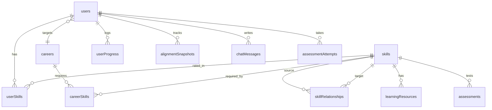

# SkillGraph — Database

MongoDB Atlas, database `skillgraph`, accessed through Mongoose (`backend/src/models/*.model.js`).

## 1. Conventions
- Collection names are camelCase plurals as below; Mongoose model names are singular PascalCase.
- Every collection has `createdAt` / `updatedAt` (Mongoose `timestamps: true`) unless stated.
- External identifiers are **slugs** (`kebab-case`, unique, immutable) for skills and careers; ObjectIds are internal. API objects expose `id` (string of `_id`) **and** `slug`.
- `toJSON` transform on every model: `_id → id`, remove `__v`, never output secret fields.
- Reference integrity is enforced in the **service layer** (Mongo does not enforce foreign keys). Use `ref` for `populate`.

## 2. Entity relationships

## 3. Collections (MVP — P0/P1)

### 3.1 `users`
| Field | Type | Rules |
|---|---|---|
| `name` | String | required, 2–80 chars, trimmed |
| `email` | String | required, **unique**, lower-cased, valid email |
| `passwordHash` | String | required, `select: false`, bcrypt cost 12 |
| `role` | String | enum `student` \| `admin`, default `student` |
| `college`, `degree`, `branch` | String | optional, ≤ 120 chars |
| `semester` | Number | optional, integer 1–8 |
| `targetCareerId` | ObjectId → `careers` | optional until onboarding done |
| `onboardingCompleted` | Boolean | default `false` |
| `llmSettings.provider` | String | enum `openrouter` (only value in MVP) |
| `llmSettings.model` | String | optional, ≤ 120 chars |
| `llmSettings.apiKeyEnc` | `{ iv, tag, ciphertext }` (base64 strings) | `select: false`; AES-256-GCM |
| `llmSettings.apiKeyLast4` | String | 4 chars, safe to return |
| `serverKeyUsage` | `{ date: 'YYYY-MM-DD', count: Number }` | counts messages on the server fallback key per day |
| `lastLoginAt` | Date | |

Indexes: `{ email: 1 }` unique · `{ role: 1 }` · `{ targetCareerId: 1 }`.

### 3.2 `skills`
| Field | Type | Rules |
|---|---|---|
| `name` | String | required |
| `slug` | String | required, **unique**, `^[a-z0-9]+(-[a-z0-9]+)*$` |
| `description` | String | 1–2 sentences, ≤ 300 chars |
| `category` | String | enum (slugs): `programming, web-development, backend, frontend, database, data-analytics, machine-learning, deep-learning, ai-llm, cloud, devops, cybersecurity, tools` |
| `difficulty` | Number | integer 1–5 (used for `effortPoints` and ML) |

Indexes: `{ slug: 1 }` unique · `{ category: 1 }` · text index on `name, description`.

### 3.3 `skillRelationships`
| Field | Type | Rules |
|---|---|---|
| `sourceSkillId` | ObjectId → `skills` | required |
| `targetSkillId` | ObjectId → `skills` | required, ≠ source |
| `relationshipType` | String | enum `PREREQUISITE` \| `RELATED_TO` |
| `strength` | Number | 0–1, default 1 |

Meaning: `PREREQUISITE` — **source must be learned before target** (arrow points from prerequisite to dependent). `RELATED_TO` — undirected; stored once with `String(sourceSkillId) < String(targetSkillId)` (service normalises).

Indexes: unique `{ sourceSkillId, targetSkillId, relationshipType }` · `{ targetSkillId: 1 }`.
Constraint (service + seed validator): the `PREREQUISITE` subgraph must stay **acyclic**.

### 3.4 `careers`
| Field | Type | Rules |
|---|---|---|
| `name` | String | required |
| `slug` | String | required, unique |
| `description` | String | ≤ 400 chars |
| `category` | String | `software` \| `data` \| `ai` |
| `icon` | String | lucide icon name used by the UI |
| `isActive` | Boolean | default `true` |

MVP careers: `software-developer`, `full-stack-developer`, `data-analyst`, `data-scientist`, `machine-learning-engineer`.

### 3.5 `careerSkills`
| Field | Type | Rules |
|---|---|---|
| `careerId` | ObjectId → `careers` | required |
| `skillId` | ObjectId → `skills` | required |
| `importance` | Number | 0–1 (see label mapping below) |
| `requiredLevel` | Number | integer 1–5 |

Unique index `{ careerId, skillId }`. This collection **replaces** the spec's `REQUIRED_FOR` edge.
Importance labels: `≥ 0.9 Very High · ≥ 0.7 High · ≥ 0.5 Medium · else Low`.

### 3.6 `userSkills`
| Field | Type | Rules |
|---|---|---|
| `userId` | ObjectId → `users` | required |
| `skillId` | ObjectId → `skills` | required |
| `proficiency` | Number | integer **1–5**. Level 0 is represented by *no document* (setting a level to 0 deletes the row) |
| `source` | String | `self` (default) \| `assessment` (reserved) |
| `lastAssessedAt` | Date | reserved |

Unique index `{ userId, skillId }` · index `{ skillId }` (analytics).

### 3.7 `userProgress` (append-only change log)
| Field | Type |
|---|---|
| `userId`, `skillId` | ObjectId |
| `previousLevel`, `currentLevel` | Number 0–5 |
| `createdAt` | Date (timestamps, no `updatedAt`) |

Written on every proficiency change. Index `{ userId: 1, createdAt: -1 }`.

### 3.8 `alignmentSnapshots`
| Field | Type |
|---|---|
| `userId`, `careerId` | ObjectId |
| `fitScore` | Number 0–100 |
| `coverage`, `readiness` | Number 0–1 |
| `trigger` | `onboarding` \| `skills_update` \| `target_change` |
| `createdAt` | Date |

Written after onboarding, any skills update, and target change. If the latest snapshot for the same user+career is **< 60 s old**, update it instead of inserting (avoids noise during rapid edits). "Previous alignment" on the dashboard = the latest snapshot **older than the current one** for the same career. Index `{ userId: 1, careerId: 1, createdAt: -1 }`.

### 3.9 `chatMessages`
| Field | Type |
|---|---|
| `userId` | ObjectId |
| `role` | `user` \| `assistant` |
| `content` | String (≤ 2000) |
| `intent` | String (assistant messages) |
| `meta` | `{ model, keySource: 'user'\|'server'\|'none', degraded: Boolean }` |
| `createdAt` | Date |

TTL index on `createdAt` (30 days) · index `{ userId: 1, createdAt: -1 }`.

## 4. Reserved collections (P2 — define models but do not build features)

| Collection | Fields |
|---|---|
| `learningResources` | `skillId, title, description, type (video\|article\|course\|docs), url, difficulty` |
| `assessments` | `skillId, question, options[], correctAnswer, difficulty` |
| `assessmentAttempts` | `userId, skillId, score, estimatedProficiency, createdAt` |

## 5. Seed data specification

Location: `/shared/seed/*.json` — all references by **slug**.

| File | Content | Target size |
|---|---|---|
| `skills.json` | `{ slug, name, description, category, difficulty }` | 60–80 skills |
| `relationships.json` | `{ source, target, type, strength }` | ~90–130 edges (mostly PREREQUISITE) |
| `careers.json` | `{ slug, name, description, category, icon }` | 5 careers |
| `career-skills.json` | `{ career, skill, importance, requiredLevel }` | 18–30 skills per career |
| `demo-users.json` | demo personas + their skill levels | see §7 |

**Seed command behaviour** (`npm run seed` in `backend`):
1. Load JSON → run the validator (§6). Abort on any error.
2. **Idempotent upsert by slug** — preserves existing `_id`s so user data is never orphaned. Never drops collections unless `--reset` is passed (dev only, refuses when `NODE_ENV=production`).
3. Resolve slugs → ObjectIds, upsert relationships and `careerSkills`; remove rows that no longer exist in the JSON.
4. Create the admin from `ADMIN_EMAIL` / `ADMIN_PASSWORD` if absent.
5. Print a summary (counts per collection).

## 6. Validator rules (`backend/seed/validate.js`, also run in tests and by admin APIs where relevant)

| # | Rule | Severity |
|---|---|---|
| V1 | Skill/career slugs are unique and kebab-case | error |
| V2 | Every referenced slug exists | error |
| V3 | `PREREQUISITE` graph has no self-loops and **no cycles** | error |
| V4 | `importance ∈ [0,1]`, `requiredLevel ∈ 1..5`, `difficulty ∈ 1..5`, `strength ∈ [0,1]` | error |
| V5 | **Closure:** for each career, every direct prerequisite of a career skill is also a skill of that career | error |
| V6 | A skill that is a prerequisite of another skill in the career has `requiredLevel ≥ 2` there (quality rule; the engine does not depend on it) | error |
| V7 | No duplicate `(career, skill)` or duplicate relationship | error |
| V8 | No `RELATED_TO` duplicate in reverse order | error |
| V9 | Orphan skills (in no relationship and no career) | warning |
| V10 | Each career has ≥ 15 skills and at least one skill with importance 1.0 | warning |
| V11 | Longest prerequisite chain ≤ 6 **edges** | warning |

## 7. Demo personas (seeded by `npm run seed:demo`)

Password for all = `DEMO_PASSWORD`. Email domain `@demo.skillgraph.dev`.

| Persona | Target | Profile | Purpose |
|---|---|---|---|
| `prabha` | Machine Learning Engineer | Python 4, JavaScript 4, React 3, SQL 3, Statistics 1, ML basics 1, Docker 1 | Main demo (matches the spec's example) |
| `asha` | Data Analyst | Mostly beginner levels, SQL 2, Excel-like skills | Shows large gaps and a long path |
| `ravi` | Full Stack Developer | Strong web stack | Shows high alignment |
| `newbie` | none (`onboardingCompleted=false`) | No skills | Shows onboarding |
| `admin` | — | role `admin` | Admin demo (credentials from env) |

Each demo student gets 2–3 historical `alignmentSnapshots` so the progress line is not empty.

## 8. Query patterns and indexes (what the analytics need)

| Need | Approach |
|---|---|
| Subgraph for a career | `careerSkills` by `careerId` → skill ids → `skillRelationships` where both ends ∈ set |
| User profile | `userSkills` by `userId` (+ skills lookup by id) |
| Skill popularity | `userSkills` group by `skillId` (count, avg proficiency) |
| Career distribution | `users` group by `targetCareerId` |
| Top skill gaps (% of students) | Load students with a target career, their `userSkills`, and `careerSkills`; compute gap per student **in the service** (data is small) |
| Semester distribution | `users` group by `semester` (+ average fit from latest snapshot) |

## 9. Rules for changing the schema
1. Propose the change in a PR touching `DATABASE.md` **and** the model.
2. Update `API.md` response shapes if they change.
3. Add/adjust seed + validator; never edit slugs of existing skills/careers.
4. Tell the owners of dependent modules (see `AGENTS.md`).
