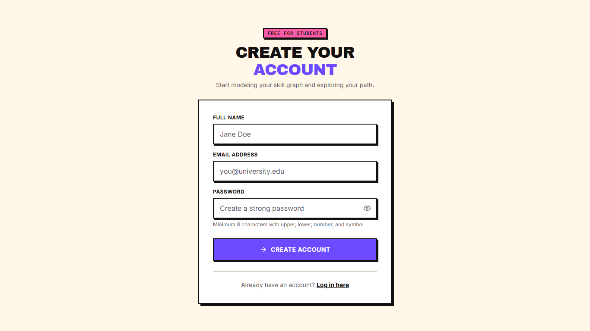
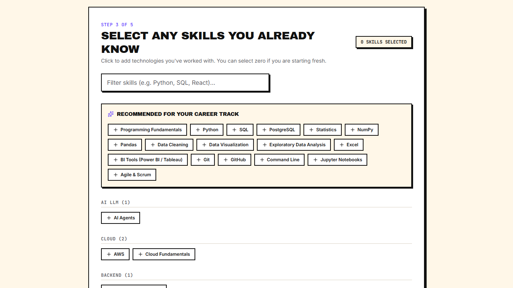
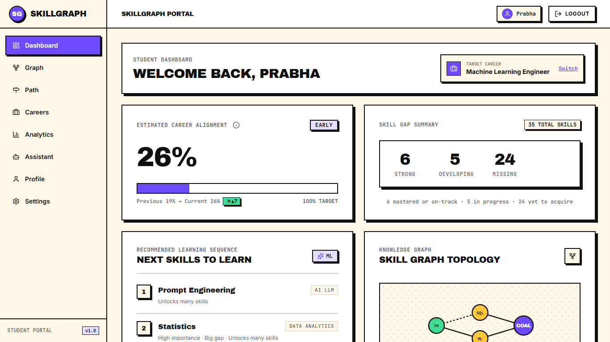
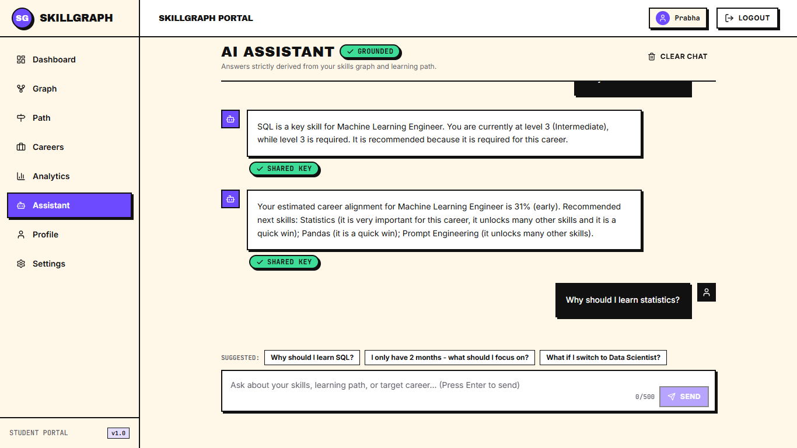
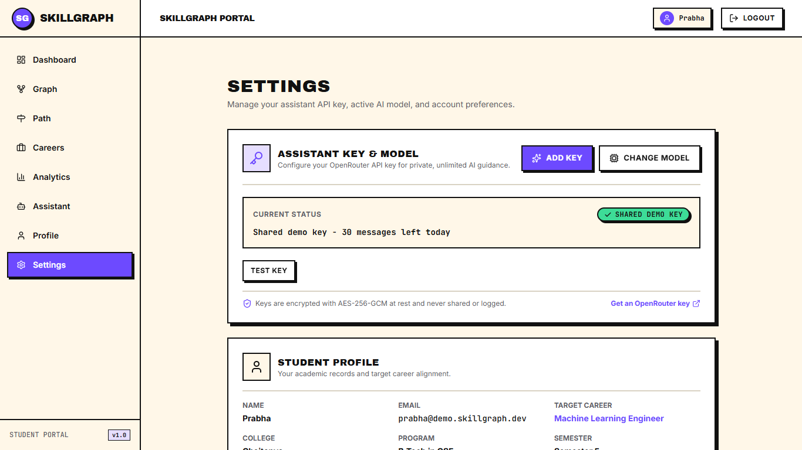
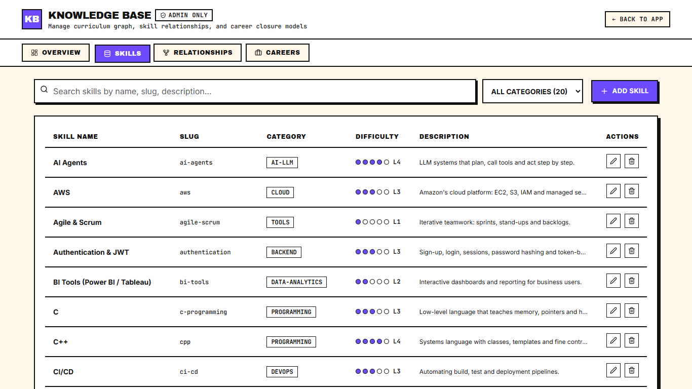
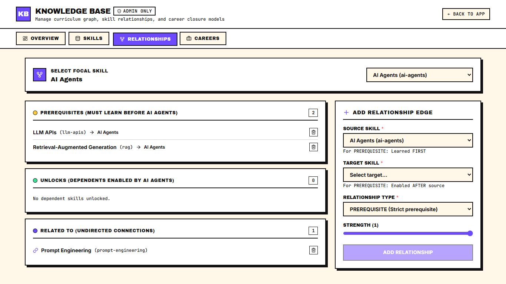
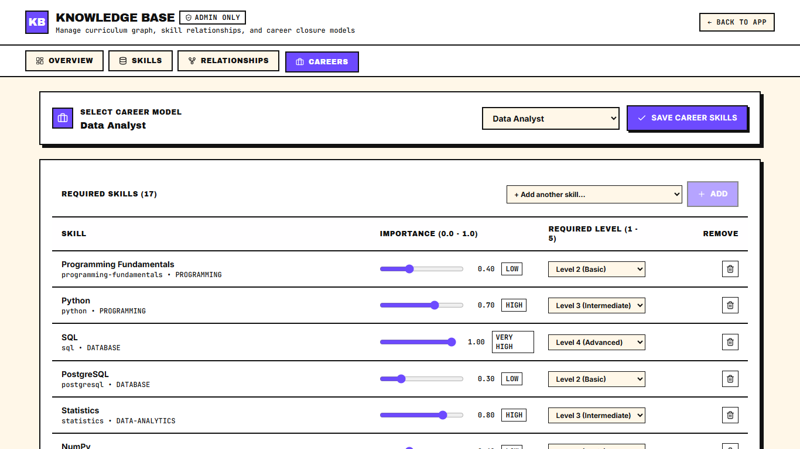

# SkillGraph — User Guide

Welcome to SkillGraph! This guide walks you through every feature of the platform, whether you are a university student planning your academic path or an administrator curating institutional competencies.

---

## Glossary of Core Concepts

Before getting started, familiarize yourself with the foundational terms used throughout SkillGraph:

- **Estimated Career Alignment:** A weighted percentage score ($0\% \text{ to } 100\%$) indicating how thoroughly your current skills fulfill what a career track requires. It combines skill coverage ($85\%$) and prerequisite readiness ($15\%$). It is an educational alignment metric, never a guarantee or probability of job placement.
- **Skill Gap:** The deficit between the required mastery level for a career and your current proficiency:
  $$\text{gap} = \max(0, \text{requiredLevel} - \text{proficiency})$$
  A gap of $0$ means the skill is fully mastered for that target career.
- **Prerequisite:** A strict dependency between two skills ($A \rightarrow B$). You must achieve mastery in skill $A$ before starting skill $B$.
- **Ready Now (`isReadyNow`):** A skill that currently has an unmet gap ($\text{gap} > 0$) but whose foundational prerequisites in the career graph are all completely fulfilled.
- **Strategy (`ML` vs `RULES`):** The engine ranking your recommended next steps. `RULES` evaluates career importance, gap size, and unlocked downstream skills. `ML` re-ranks candidates using a machine learning model trained on cohort learning trajectories.

---

## Part A: Student Guide

### 1. Register Your Account

Create a new student account to initiate your personalized learning graph.

1. Open http://localhost:5173/register in your browser (or click **GET STARTED** from the landing page).
2. Enter your full name, university email address, and a secure password.
3. Review the live password validation checklist: at least 8 characters, with uppercase, lowercase, number, and special character requirements.
4. Click **CREATE ACCOUNT**. You are automatically authenticated via a secure HTTP-only session cookie and directed to the onboarding wizard.

---

### 2. Complete the Onboarding Wizard

Set up your academic profile, target career track, and initial competencies in 5 quick steps.

1. **Step 1 (About you):** Select your current academic semester ($1 \text{ to } 8$, required). Optionally provide your college, degree, and branch.
2. **Step 2 (Target career):** Choose your target industry track from the 5 available careers (e.g. *Machine Learning Engineer*, *Data Scientist*, or *Full Stack Developer*).
3. **Step 3 (Select skills):** Search and select the skills you already know. Use the "Recommended for your career" section or browse by category chips.
4. **Step 4 (Rate proficiency):** Rate your competency level for each selected skill (Level 1: Novice to Level 5: Expert). Rating a skill as $0$ removes it from your list.
5. **Step 5 (Review):** Verify your selections and click **BUILD MY GRAPH**. Your profile is saved and your personalized dashboard renders immediately.

---

### 3. Read Your Dashboard

Your home base for tracking your progress and discovering recommended next steps.

1. Navigate to http://localhost:5173/app/dashboard.
2. **Estimated Career Alignment:** Check your headline alignment score ($0\% \text{ to } 100\%$), the visual progress bar, and your progress delta compared to your last milestone.
3. **Skill Summary Cards:** View your overall competency breakdown:
   - **Strong:** Skills where your proficiency meets or exceeds career requirements ($\text{gap} = 0$).
   - **Developing:** Skills where you have begun learning ($\text{proficiency} > 0$) but have not reached the required level.
   - **Missing:** Required career competencies you have not started yet ($\text{proficiency} = 0$).
4. **Next Recommended Skills:** Inspect your top 3 prioritized skills. Each recommendation displays a rationale tag (e.g. *High importance*, *Unlocks 4 skills*) and an algorithm strategy badge (`ML` or `RULES`).

---

### 4. Explore the Skill Graph

Visualize your curriculum as an interactive Directed Acyclic Graph (DAG) with prerequisites clearly mapped.

1. Navigate to http://localhost:5173/app/graph.
2. **Navigate the Canvas:** Click and drag to pan across the graph. Use your mouse scroll wheel, trackpad gestures, or the bottom-right controls to zoom. Click the **Fit view** button to center the entire curriculum.
3. **Understand Node Statuses:** Nodes use distinct neo-brutalist colors and icons:
   - **Green with Check (✓):** Mastered ($\text{gap} = 0$).
   - **Amber with Dot (⊙):** In Progress ($\text{gap} > 0 \land \text{proficiency} > 0$).
   - **Coral with Cross (✕):** Missing / Not Started ($\text{gap} > 0 \land \text{proficiency} = 0$).
   - **Cyan with Sparkles (✦):** Recommended Next Step (Ready Now).
4. **Search and Locate:** Type a skill name in the search box to highlight and center that node on the canvas.
5. **Inspect & Update Skills:** Click on any node (e.g. *Statistics*) to open the slide-out detail panel.

6. **In-Drawer Actions:**
   - Review career required levels, importance ratings, and difficulty.
   - Click connected **Prerequisites** or **Unlocks** chips to smoothly pan to related skills.
   - Use the **LevelPicker** (0–5) to record newly acquired proficiency. The graph and your alignment score update immediately.
   - Click **Why this?** to generate a grounded explanation from the AI assistant.

---

### 5. Follow Your Learning Pathway

A linear, prerequisite-aware roadmap that guarantees you learn foundational topics before advanced concepts.

1. Navigate to http://localhost:5173/app/path.
2. **Ready Now Steps:** Steps labeled with a bright **READY NOW** badge have all prerequisites satisfied and can be started immediately.
3. **Blocked Steps:** Steps with missing prerequisites display a yellow **Needs:** badge detailing which competencies must be mastered first.
4. **Effort & Reason Tags:** Each step indicates estimated effort points and clear curricular reasons (such as *High importance*, *Big gap*, or *Quick win*).
5. **Update Mastery In-Line:** After learning a concept, update its level using the inline **LevelPicker**. The step completes with a "✓ Done" indicator and downstream steps become ready.
6. **Time Budget Filter:** Adjust the weeks slider to highlight what you can realistically complete within your target study period.

---

### 6. Compare Careers and Run What-If Simulations

Evaluate multiple career options side-by-side and simulate the impact of switching targets.

1. Navigate to http://localhost:5173/app/careers.
2. **Catalog Overview:** Browse cards for all 5 career tracks with your real-time estimated alignment score shown on each card.
3. **Side-by-Side Comparison:** Click **COMPARE** on any two careers to launch a 3-column breakdown.

4. **Analyze Career Overlap:**
   - **Only in Career A:** Unique skills required only by the first track.
   - **In Both Careers:** Shared foundational competencies you can transfer between tracks.
   - **Only in Career B:** Unique skills required only by the second track.
5. **Simulate Switching Targets:** Click **WHAT IF I SWITCH?** on any alternative career card.

6. **Review the Simulation:** Inspect your projected alignment score, score delta (e.g. $+11\%$), newly required prerequisite skills, and effort points.
7. Click **SET AS TARGET** to permanently switch your target career track, or click **Cancel** to close the simulation without saving.

---

### 7. Consult the Grounded AI Assistant

Receive personalized curriculum explanations grounded in your verified student profile.

1. Navigate to http://localhost:5173/app/assistant (or click "Ask why" from any skill panel).
2. **Select or Type a Query:** Click one of the pre-built prompt chips (e.g. *"Why should I learn SQL?"*, *"I only have 2 months — what should I focus on?"*) or type your own question in the input field.
3. **Verify Grounding:** Below each assistant response, inspect the **grounded in** metadata line listing the specific profile skills and career requirements used to generate the answer.
4. **Offline Fallbacks:** If the OpenRouter service is unavailable, the assistant automatically provides an instant structured fallback template without crashing.
5. **Reset History:** Click **CLEAR CHAT** in the header at any time to clear your conversation history.

---

### 8. Configure Your LLM API Key (BYOK)

SkillGraph supports Bring-Your-Own-Key (BYOK) for OpenRouter, allowing you to use your personal API key and preferred models.

1. Navigate to http://localhost:5173/app/settings.
2. Review your current assistant key status (shared demo tier vs personal key).
3. Click **ADD KEY** (or **MANAGE KEY**) to open the configuration modal.
4. Paste your OpenRouter API key and select or enter your desired model (e.g. `meta-llama/llama-3.3-70b-instruct:free`).
5. Click **TEST KEY**. The backend validates the key against OpenRouter, encrypts it securely at rest using AES-256-GCM, and clears the raw key input from the screen.

---

## Part B: Administrator Guide

### 1. Institutional Analytics & Model Benchmarks

Monitor institutional cohort trends, identify curriculum bottlenecks, and track recommendation model metrics.

1. Log in with an administrator account (`admin@skillgraph.dev`) and navigate to http://localhost:5173/admin/overview.
2. **Cohort Overview:** Review institutional KPI cards: total registered students, onboarded student count, average student alignment score ($44\%$), and active skills and careers.
3. **Top Curriculum Gaps:** Identify competencies with the highest percentage of student deficits (`% with Gap`). Use this data to schedule supplementary workshops or revise prerequisites.
4. **Career Distribution & Semester Growth:** Analyze career popularity across the student body and track average alignment progression across Semesters 1 through 8.
5. **ML Model Benchmarks Panel:** Review recommendation ranking accuracy (Precision@3, Recall@3, HitRate@3, MRR) comparing the synthetic-trained logistic regression model against rule-based baselines.
6. **Privacy Guarantee:** All admin data is strictly aggregated; no student names, emails, or personal identifiers are displayed or accessible.

---

### 2. Manage the Skill Knowledge Base

Add, edit, or categorize competencies in the institutional knowledge base.

1. Navigate to http://localhost:5173/admin/skills.
2. **Search and Filter:** Locate skills by name or filter across the 13 defined categories.
3. **Add a Competency:** Click **ADD SKILL** to create a new skill. Provide a unique slug (lowercase hyphenated), display name, category, and difficulty level (1–5).
4. **Edit Metadata:** Click **EDIT** on any skill row to update its name, category, or difficulty.
5. **Safe Deletions:** Attempting to delete a skill currently in use by an active career track or relationship is blocked with a clear dependency warning.

---

### 3. Manage Prerequisites & Prevent Cyclic Dependencies

Create and audit directed prerequisite and related relationships between competencies.

1. Navigate to http://localhost:5173/admin/relationships.
2. **Inspect Dependencies:** Select any skill from the dropdown to view its inbound prerequisites, outbound unlocks, and bidirectional related links.
3. **Add an Edge:** Choose a source skill, target skill, and relationship type (`PREREQUISITE` or `RELATED_TO`), then click **ADD RELATIONSHIP**.
4. **Cycle Prevention:** If adding a relationship would introduce a circular dependency (e.g. $A \rightarrow B \rightarrow A$), the system blocks the edge and displays a clear error modal detailing the detected cycle.

---

### 4. Configure Careers & Enforce Prerequisite Closures

Curate curriculum requirements for industry career tracks and maintain prerequisite integrity.

1. Navigate to http://localhost:5173/admin/careers.
2. Select a career track from the list to view its configured skills, required proficiency levels (1–5), and importance weights ($0.0 \text{ to } 1.0$).
3. **Modify Requirements:** Adjust skill importance sliders and required levels, or add new skills to the career curriculum.
4. **Prerequisite Closure Enforcement:** If you add an advanced skill without its required foundational prerequisites, the backend blocks saving and displays an **Add missing prerequisites** button.
5. Clicking this button automatically appends the missing prerequisite skills with sensible default levels, ensuring the career subgraph remains topologically closed and valid.

---

## Need Assistance?

- For questions regarding your personal learning path or prerequisite explanations, consult the in-app **Assistant** (`/app/assistant`).
- To report curriculum relationship anomalies or request new career tracks, contact your academic administrator at `admin@skillgraph.dev`.
