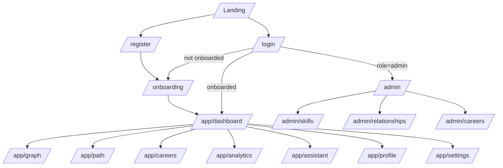
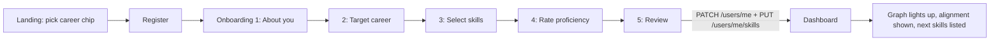

# SkillGraph — UX Flows

How people move through the product. Visual rules are in `DESIGN_SYSTEM.md`; data comes from `API.md`.

## 1. Sitemap and access

### Page inventory
| Route | Page | Access | Main endpoints | Owner |
|---|---|---|---|---|
| `/` | Landing | public | `GET /meta` | M1 |
| `/register`, `/login` | Auth forms | public (redirect if logged in) | `POST /auth/register`, `POST /auth/login` | M1 |
| `/onboarding` | 5-step wizard | student, not onboarded | `GET /careers`, `GET /careers/:slug`, `GET /skills`, `PATCH /users/me`, `PUT /users/me/skills` | M1 |
| `/app/dashboard` | Dashboard | student | `GET /analysis/dashboard`, `GET /analysis/graph` | M1 |
| `/app/graph` | Skill graph | student | `GET /analysis/graph`, `GET /skills/:slug`, `PATCH /users/me/skills/:skillSlug`, `POST /ai/explain` | M4 |
| `/app/path` | Learning path | student | `GET /analysis/learning-path`, `PATCH /users/me/skills/:skillSlug`, `POST /ai/explain` | M4 |
| `/app/careers` | Career explorer | student | `GET /careers`, `GET /analysis/career-fit`, `GET /analysis/career-compare`, `POST /analysis/what-if`, `PATCH /users/me` | M4 |
| `/app/analytics` | Student insights | student | `GET /analysis/insights`, `GET /analysis/skill-gap` | M4 |
| `/app/assistant` | Assistant (full page) | student | `POST /ai/chat`, `GET /ai/history`, `DELETE /ai/history` | M5 |
| `/app/profile` | Profile + skills editor | student | `GET /users/me`, `PATCH /users/me`, `GET /users/me/skills`, `PUT /users/me/skills` | M1 |
| `/app/settings` | API key and model | student | `GET/PUT /settings/llm`, `DELETE /settings/llm/key`, `POST /settings/llm/test`, `GET /settings/llm/suggested-models` | M1 (page) + M5 (modal) |
| `/admin` | Admin analytics | admin | `GET /admin/analytics/*`, `GET /admin/ml/info` | M4 |
| `/admin/skills` | Manage skills | admin | `GET /skills`, `POST/PATCH/DELETE /admin/skills*` | M2 |
| `/admin/relationships` | Manage relationships | admin | `GET /skills`, `GET/POST/DELETE /admin/relationships*` | M2 |
| `/admin/careers` | Manage careers | admin | `GET /careers`, `GET /careers/:slug`, `POST/PATCH /admin/careers*`, `PUT /admin/careers/:slug/skills` | M2 |

Guards: unauthenticated → `/login?next=<path>`; authenticated but `onboardingCompleted=false` → `/onboarding`; non-admin on `/admin*` → friendly 403 page.

## 2. Flows

### F1 — First visit to first insight (the main journey)

**Onboarding steps**
| Step | Content | Rules |
|---|---|---|
| 1 About you | name (prefilled), college, degree, branch, semester (1–8) | semester required; others optional |
| 2 Target career | five career cards with description and skill count; preselected if `?career=` was in the URL | exactly one selected, required |
| 3 Select skills | search box; group "Recommended for <career>" first, then categories; click chips to add | may select zero (allowed) |
| 4 Rate proficiency | one row per selected skill with `LevelPicker` (default 2); bulk presets "Beginner / Intermediate / Advanced" | rating 0 removes the skill |
| 5 Review | summary of profile, career, skills; button `BUILD MY GRAPH` | on success go to dashboard with a "Your graph is ready" toast |

Back/Next preserve entries in memory (and `sessionStorage` as a P2 nicety). Closing the tab before step 5 saves nothing; the user is routed back to onboarding next time.

### F2 — Update a skill and see everything change (Definition of Done #13–14)
1. On **Graph** or **Path**, the student changes the `LevelPicker` for a skill (e.g. Statistics 1 → 3).
2. UI optimistically updates the picker and shows a small spinner; `PATCH /users/me/skills/:skillSlug`.
3. On success: toast "Statistics updated to Intermediate"; invalidate `graph`, `path`, `dashboard`, `skill-gap`, `insights`.
4. Node recolours (missing → partial), alignment number animates to the new value (+Δ chip), next skills re-rank.
5. On failure: revert picker, toast with retry.

### F3 — Explore the skill graph
1. Open `/app/graph` → skeleton → graph renders fitted to view.
2. Pan/zoom with mouse, trackpad or the toolbar; search a skill name to centre it.
3. Click a node → right panel opens (`GET /skills/:slug`): category, **your proficiency** (editable), status, required for, prerequisites, unlocks, importance. Prerequisite/unlock chips are clickable and re-centre the graph.
4. `Why this?` → `POST /ai/explain` → answer appears in the panel (with degraded/no-key notices if applicable).
5. Toggle `Show related links` to add dashed `RELATED_TO` edges.
Edge cases: very large subgraphs → toolbar `Fit view`; empty profile → all nodes red/blue with banner "Add your skills to see your progress" linking to profile.

### F4 — Follow the learning path
1. `/app/path` lists ordered steps. Step 1–3 are marked `READY NOW` when `isReadyNow`; later steps show "Needs: <prerequisites>".
2. Each step shows `from → to` levels, effort chip (`effortPoints`), reason tags (`HIGH_IMPORTANCE` → "High importance", `LARGE_GAP` → "Big gap", `UNLOCKS_MANY` → "Unlocks many skills", `QUICK_WIN` → "Quick win").
3. After learning, the student sets the new level in-line (F2). Completed steps disappear from the path and celebrate with a small confetti-free "✓ Done" stamp.
4. `Ask why` opens the assistant with a prefilled question.

### F5 — Compare careers and ask "What if?"
1. `/app/careers`: career cards show the student's alignment for each career (`GET /analysis/career-fit?career=<slug>` per career, fetched in parallel and cached).
2. Select two careers → `GET /analysis/career-compare` → three columns: **Only A · In both · Only B** with importance bars; header shows each alignment and pathway length.
3. `What if I switch?` on a career → `POST /analysis/what-if` → modal: old vs new alignment, delta chip (▲/▼), top priority skills, newly required skills.
4. `Set as my target` (confirm dialog) → `PATCH /users/me { targetCareerSlug }` → dashboard and graph refresh. Cancelling changes nothing.

### F6 — Ask the assistant
1. Panel/page shows suggested prompts: *"Why should I learn SQL?"*, *"I only have 2 months — what should I focus on?"*, *"What if I switch to Data Scientist?"*.
2. Student types (max 500 chars, counter shown) → `POST /ai/chat` → typing indicator → reply bubble.
3. Under each reply, small meta line: `grounded in: Statistics, ML Fundamentals` and key badge (`Your key` / `Shared key`).
4. If `degraded: true`: inline notice "Quick answer (AI is unavailable right now)". If `notice` present: show it with a link to Settings.
5. `Clear chat` → `DELETE /ai/history` (confirm).
Out-of-scope questions get a polite redirect: "I can help with your skills and career path."

### F7 — Add your own API key and model
1. `/app/settings` → card "ASSISTANT KEY & MODEL" shows status: `Shared demo key — 22 messages left today` or `Your key ••••a1b2 · model <id>`.
2. `Add key` opens the modal (design in `DESIGN_SYSTEM.md` §10): create key link → paste → choose/enter model → `Test key`.
3. `Test key` → `POST /settings/llm/test` (after `PUT` of unsaved values: the modal saves first, then tests; on failure it keeps the key but shows the error and offers `Remove key`).
4. Success toast "Key saved. The assistant will use it from now on."; the key field is cleared and never shown again.
5. `Remove key` → `DELETE /settings/llm/key`.

### F8 — Check analytics
**Student** (`/app/analytics`): skills by category (bar), alignment history (line, needs ≥ 2 snapshots else empty state), top missing skills (bar).
**Admin** (`/admin`): overview stat boxes, top skill gaps (%), career distribution, skill popularity, semester table, and a **Model panel** (algorithm, "trained on synthetic data", ML vs baseline metrics).

### F9 — Admin manages the knowledge base
- **Skills:** table with search + category filter; `ADD SKILL` / row `EDIT` open a modal; delete is blocked with an explanation if the skill is used.
- **Relationships:** pick a skill → see its prerequisites/unlocks/related; add an edge via two selects + type; cycle attempt shows *"That would create a loop: A → … → B → A."* (from the 422 message).
- **Careers:** edit a career's skill list in a table (importance slider 0–1, required level 1–5). Saving with missing prerequisites shows the list returned in `details` and an `Add missing prerequisites` button that appends them with default values for the admin to adjust.

### F10 — Session and errors
- Session expired → any 401 clears auth state and redirects to `/login?next=…` with toast "Please log in again".
- Network error → page-level `ErrorState` with `RETRY`.
- 429 → toast "Slow down a little and try again in a minute."
- 403 on admin pages → "This area is for admins."

## 3. State matrix (required on every data view)
| State | Treatment |
|---|---|
| Loading | `Skeleton` blocks matching the final layout (no spinners alone) |
| Empty | `EmptyState` with a single next action |
| Error | `ErrorState` with message + `RETRY` |
| Partial / degraded | Inline notice (e.g. ML fallback badge `RULES`, LLM `Quick answer`) |
| Success | Content + toast only for user-initiated writes |

## 4. Content rules for key screens
- **Alignment card:** `61%` (display font), label `ESTIMATED CAREER ALIGNMENT`, info tooltip: *"A weighted score of how well your skill levels match what this career needs. It is an estimate, not a prediction of success."*, progress bar, `Previous 54% → Current 61% ▲7`.
- **Summary:** three `StatBox`es `STRONG 12 · DEVELOPING 7 · MISSING 9`.
- **Next skills:** numbered 1–3, each with a one-line reason built from reason codes and a strategy badge (`ML` or `RULES`; tooltip explains).
- **Strategy badge `ML`:** tooltip "Ranked by a model trained on synthetic student data." `RULES`: "Ranked by importance, gap and prerequisites."

## 4b. Accessibility and responsiveness notes
- Every flow is completable by keyboard; `LevelPicker` supports arrow keys; the wizard moves focus to the step heading on change.
- Graph nodes are focusable; `Enter` opens the panel; `Esc` closes it.
- Tablet: panels become bottom sheets. Phone: best-effort; wizard and dashboard must work, graph is pan/zoom only.

## 5. Acceptance walk-through (used for rehearsal on 12 Oct)
Log in as `newbie` → onboard as Data Analyst → see dashboard → open graph → raise SQL → watch alignment rise → open path → ask assistant "Why should I learn SQL?" → compare Data Analyst vs Data Scientist → what-if → open Settings, add key → log in as `admin` → manage a skill → view analytics and model panel. Full checklist in `TESTING.md` §6.
