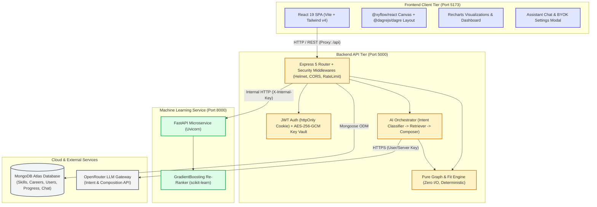

# Executive Summary & System Overview

## 1. The Problem

Higher education curricula and technical career competency models are inherently non-linear Directed Acyclic Graphs (DAGs). However, traditional education systems and career platforms treat learning as disconnected, flat checklists. Engineering students frequently master programming languages and theoretical concepts without understanding:
1. Which specific competencies target industry roles actually require,
2. What foundational prerequisites must be mastered before advanced topics can be understood,
3. Where their personal skill gaps lie and how far along they are in their career readiness, and
4. What exact, ordered sequence of steps will bridge those gaps without hitting roadblock dependencies.

Existing platforms provide either static course catalogs or black-box assessment quizzes that offer no explainable rationale or topological guidance.

---

## 2. What SkillGraph Does in Five Lines

1. **Models Technical Competencies as a DAG:** Represents 71 skills and 85 multi-hop relationships with validated prerequisite closure across 5 industry careers.
2. **Computes Interpretable Career Alignment:** Evaluates student proficiency against career requirements using a deterministic formula ($85\%$ weighted skill coverage $+ 15\%$ prerequisite readiness).
3. **Generates Prerequisite-Aware Pathways:** Topologically sequences skill acquisition so no advanced competency is recommended before its foundational prerequisites are met.
4. **Personalizes via Evaluated Machine Learning:** Re-ranks candidate skills using a Gradient Boosting model trained and benchmarked against an engine baseline on synthetic student profiles.
5. **Explains Pathways via Grounded LLM Intelligence:** Delivers conversational explanations through a 2-stage retrieval-augmented assistant that explains engine facts with zero hallucinations.

---

## 3. High-Level System Architecture

SkillGraph is organized as a modular, three-tier monorepo combining a modern React single-page application, an Express MVC REST API, a dedicated FastAPI machine learning microservice, and cloud infrastructure:

---

## 4. Team Ownership & Responsibilities

The system was designed and delivered by a five-member team following the directory ownership map established in `AGENTS.md` §4:

| Member | Engineering Role | Core Module Ownership | Key Deliverables |
|---|---|---|---|
| **Member 1** | Frontend Core | `frontend/src/{styles,routes,context,components/ui,components/layout}`, `pages/{Landing,Login,Register,Onboarding,Dashboard,Profile,Settings}` | Design tokens, neo-brutalist theme, responsive app shell, auth workflows, onboarding wizard, student profile, BYOK settings modal. |
| **Member 2** | Backend Core | `backend/src/{app,server,config,middleware,utils,models,validators}`, `routes/{auth,users,skills,careers,admin}`, `pages/admin/{Skills,Relationships,Careers}` | Express MVC architecture, Mongoose schemas, JWT cookie authentication, Zod input validation, database seeder with prerequisite validator, Admin CRUD UI. |
| **Member 3** | Knowledge Base, Engine & ML | `shared/seed`, `backend/src/services/engine`, `routes/analysis`, `ml-service/**` | Seed catalog (71 skills, 5 careers), pure graph algorithm engine (gap, fit, path, what-if, compare), synthetic dataset generation, FastAPI ML ranking service. |
| **Member 4** | Visualization & Analytics | `frontend/src/components/{graph,charts}`, `pages/{SkillGraph,LearningPath,CareerExplorer,Analytics,admin/Overview}`, `backend/src/services/analytics` | React Flow DAG canvas with Dagre left-to-right layering, interactive node inspection drawer, learning path step cards, career comparator, student & admin analytics. |
| **Member 5** | LLM & Integration | `backend/src/services/{ai,llm,ml}`, `routes/{ai,settings,recommendations}`, `backend/src/utils/crypto.js`, `frontend/src/components/chat`, `pages/Assistant` | Two-stage grounded assistant pipeline, 7 facts retrievers, AES-256-GCM BYOK key encryption, 4-level degradation ladder, ML client integration, evaluation test harness. |

---

## 5. Definition of Done Verification

All core capabilities defined in the Product Requirements Document (`PRD.md` §10 and §6) were implemented, integrated, and verified against the live running application:

| # | PRD Definition of Done Criterion | Status | Verification & Running Implementation |
|---|---|---|---|
| **1** | Register and log in | **DONE** | Validated via `POST /api/auth/register` and `/login`. Issues `httpOnly` JWT session cookie. Passwords hashed with bcrypt (cost 12). |
| **2** | Create student profile | **DONE** | College, degree, branch, semester, and personal details captured during onboarding wizard and editable in Profile. |
| **3** | Select a target career | **DONE** | Student selects from 5 validated career pathways (*Machine Learning Engineer*, *Data Scientist*, *Full Stack Developer*, etc.). |
| **4** | Select current skills | **DONE** | Multi-select skill grid grouped into career-recommended skills and broader technical competencies. |
| **5** | Set proficiency levels | **DONE** | Ratings from Level 1 (Beginner) to Level 5 (Expert) persisted to `userSkills`; Level 0 cleanly omitted from database. |
| **6** | View interactive skill graph | **DONE** | React Flow canvas rendering prerequisite-closed career subgraph with Dagre auto-layout, zoom, pan, and fit-to-view. |
| **7** | Identify missing skills | **DONE** | Node states rendered using coral `bg-state-missing` badges; complete gap summary table sorted by priority. |
| **8** | Understand prerequisite relationships | **DONE** | Directed graph edges, BFS chain resolution in node detail drawer, and conversational relationship explanations. |
| **9** | Receive an ordered learning pathway | **DONE** | Topologically sequenced learning path where no skill appears prior to unmet prerequisites; week-by-week effort budgeting. |
| **10** | See interpretable career alignment | **DONE** | Transparent 0–100% score computed as $85\%$ weighted skill coverage $+ 15\%$ prerequisite readiness with alignment history tracking. |
| **11** | Ask assistant about learning pathway | **DONE** | Interactive chat interface handling 7 distinct intents (*explain_skill*, *time_boxed_plan*, *what_if*, etc.). |
| **12** | Grounded explanations in student data | **DONE** | Verified via evaluation harness: 100% factually grounded responses with zero hallucinations across 12 benchmark prompts. |
| **13** | Update skills interactively | **DONE** | Immediate proficiency updating via skill detail panel slider or gap table without requiring full page reload. |
| **14** | Dynamic graph and recommendation updates | **DONE** | TanStack Query invalidates cache keys on mutation; node colors, fit score, and next recommendations update in real time. |
| **15** | View student & admin analytics | **DONE** | Student category mastery radar and alignment progress; Admin aggregate metrics (skill gaps, career distribution). |

*Note on Project Scope:* In accordance with `PRD.md` §3 and §5, P2 stretch items (quiz-based assessments, third-party learning resource scrapers, and Kubernetes cloud deployments) were explicitly designated as non-goals to focus engineering rigor on graph correctness, ML benchmarking, and grounded conversational intelligence.

---

## 6. Technology Stack & Pinned Versions

The platform runs on modern, long-term-supported runtimes and actively pinned dependency versions:

| Component | Technology | Version | Purpose & Architectural Role |
|---|---|---|---|
| **Runtime** | Node.js | `v22.16.0` (LTS) | Server-side JavaScript execution environment for backend and tooling. |
| **Backend Core** | Express | `5.2.1` | REST API framework handling routing, middleware, and MVC orchestration. |
| **Database ODM** | Mongoose | `9.11.0` | Object Data Modeling library managing MongoDB Atlas schemas and indexes. |
| **Validation** | Zod | `4.6.5` | Strict schema validation for request bodies, query params, and LLM JSON outputs. |
| **Security** | Bcryptjs / Jsonwebtoken | `3.0.3` / `9.0.3` | Password hashing (cost 12) and cryptographically signed session tokens. |
| **Security Headers** | Helmet / Express-Rate-Limit | `8.3.0` / `8.7.1` | Secure HTTP response headers and endpoint rate limiting. |
| **Frontend Core** | React / React DOM | `19.2.8` | Declarative user interface library powering single-page application. |
| **Build Tool** | Vite | `8.3.0` | High-performance frontend bundler and development proxy server. |
| **Styling** | Tailwind CSS | `4.3.3` | Utility-first styling engine adhering to the neo-brutalist design system. |
| **Routing** | React Router | `7.18.4` | Client-side routing, protected auth layouts, and URL parameter handling. |
| **Server State** | TanStack Query | `5.104.1` | Asynchronous cache synchronization, query invalidation, and request deduplication. |
| **Graph Visualization** | @xyflow/react | `12.12.0` | Hardware-accelerated interactive node-edge canvas (React Flow). |
| **Graph Layout** | @dagrejs/dagre | `3.1.1` | Directed acyclic graph hierarchical left-to-right topological layout algorithm. |
| **Data Visualization** | Recharts | `3.10.1` | Composable charting library rendering category radars, bar charts, and history lines. |
| **Icons** | Lucide React | `1.52.0` | Accessible, consistent geometric icon system for status badges and navigation. |
| **ML Framework** | Python / FastAPI | `3.10+` / `0.142.4` | Asynchronous ASGI web framework serving ML recommendation endpoints. |
| **ASGI Server** | Uvicorn | `0.54.0` | High-throughput lightning-fast ASGI web server for Python microservice. |
| **Machine Learning** | Scikit-learn | `1.9.1` | Gradient Boosting classifier for candidate skill re-ranking. |
| **Data Science** | Pandas / NumPy | `3.0.6` / `2.5.3` | High-performance feature matrix processing and vector math. |
| **Test Suites** | Vitest / Supertest / Pytest | `5.0.3` / `7.3.1` / `9.1.1` | Unit, integration, and golden-parity test runners across JavaScript and Python. |
