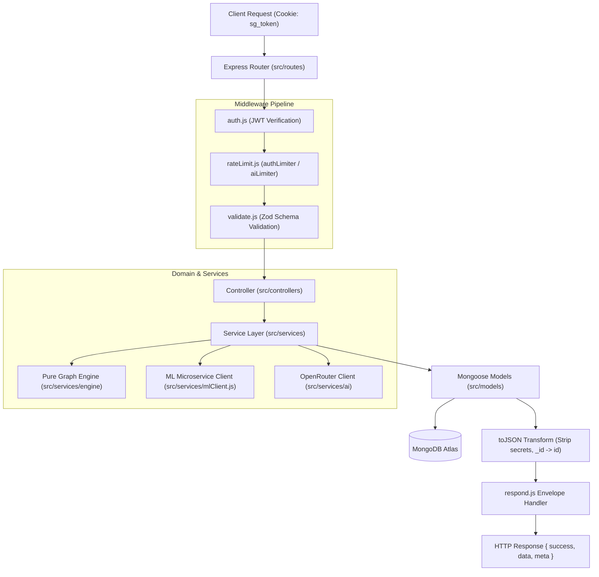
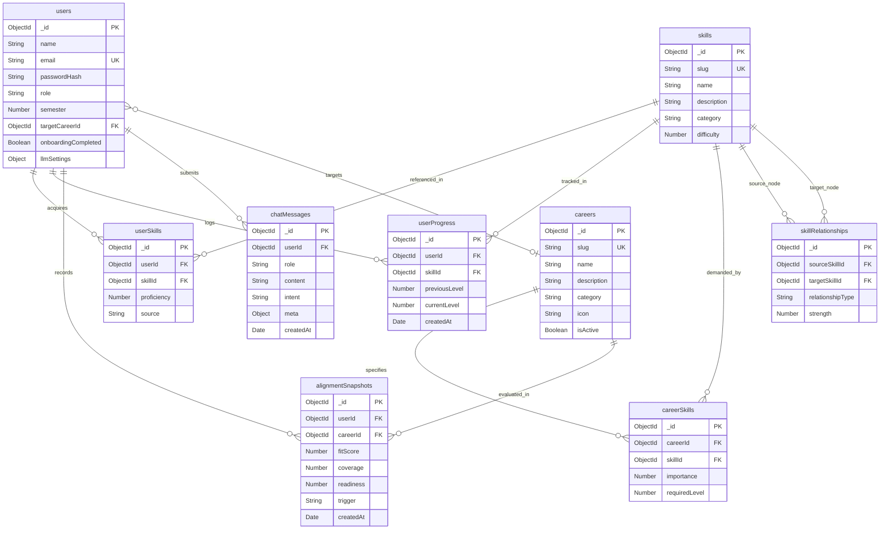

# Chapter: Backend Architecture & Database Design

## 1. MVC Structure & Request Lifecycle

The SkillGraph backend is implemented using Node.js (ES Modules) and Express 5, adhering to a strict Model-View-Controller (MVC) architectural pattern separated into four distinct tiers:

1. **Routing Tier (`src/routes`)**: Mounts endpoint paths, declares HTTP verbs, and binds route-level middlewares (authentication, role guards, rate limiters, and Zod input validators).
2. **Controller Tier (`src/controllers`)**: Acts as a thin orchestration layer. It unwraps validated request inputs (`req.validated.body`, `req.params`), delegates business workflows to the service layer, and shapes the standard HTTP response envelope.
3. **Service Tier (`src/services`)**: Contains all domain logic, database operations, cache management, and external integration. The core graph algorithm engine (`src/services/engine`) is completely pure—it performs zero database queries, HTTP calls, or environment access.
4. **Model Tier (`src/models`)**: Defines Mongoose schemas, field data types, index constraints, lifecycle hooks, and sanitizing `toJSON` transforms.



### Trace of an Example Request: `PATCH /api/users/me/skills/:skillSlug`

To illustrate data flow across all layers, consider a student updating their proficiency in **Statistics** to level 3:

```
PATCH /api/users/me/skills/statistics
Cookie: sg_token=<jwt_token>
Content-Type: application/json

{ "proficiency": 3 }
```

1. **Routing & Authentication (`routes/userSkills.routes.js`, `middleware/auth.js`)**:
   - The root router mounts `userRouter` under `/api/users`, which in turn mounts `userSkillsRouter`.
   - Router middleware `auth` intercepts the request, reads `req.cookies.sg_token`, verifies the HS256 signature via `jwt.verify(token, env.JWT_SECRET)`, and sets `req.user = { id: '6705...', role: 'student' }`. If the cookie is missing or invalid, it immediately halts execution with `401 UNAUTHENTICATED`.
2. **Validation (`middleware/validate.js`, `validators/userSkills.validator.js`)**:
   - `validate(skillParamSchema, 'params')` validates that `:skillSlug` matches `^[a-z0-9]+(-[a-z0-9]+)*$`.
   - `validate(patchSkillSchema, 'body')` validates that `proficiency` is an integer between `0` and `5` using `z.object({ proficiency: z.number().int().min(0).max(5) }).strict()`.
3. **Controller Execution (`controllers/userSkills.controller.js`)**:
   - `patchSkill` extracts `userId = req.user.id`, `skillSlug = req.params.skillSlug`, and `proficiency = req.body.proficiency`.
   - Calls `userSkillsService.updateSkillProficiency(userId, skillSlug, proficiency)`.
4. **Service Operations (`services/userSkills.service.js`)**:
   - **Catalog Lookup**: Queries `Skill.findOne({ slug: 'statistics' }).select('_id slug name').lean()`.
   - **Current State Lookup**: Queries `UserSkill.findOne({ userId, skillId })` to determine `previousLevel` (e.g., level 1).
   - **Upsert Proficiency**: Executes `UserSkill.findOneAndUpdate({ userId, skillId }, { proficiency: 3, source: 'self' }, { upsert: true, new: true, runValidators: true })`.
   - **Audit Progress Log**: Writes an append-only entry to `UserProgress.create({ userId, skillId, previousLevel: 1, currentLevel: 3 })`.
   - **Cache Invalidation**: Invokes `invalidateProfile(userId)` to purge in-memory profile caches in `profile.service.js`.
   - **Snapshot Re-alignment**: Triggers `recordSnapshot(userId, 'skills_update')`. The alignment service recomputes alignment against the student's target career using the pure engine and updates or inserts into `alignmentSnapshots`.
5. **Serialization & Response Envelope (`utils/respond.js`, `models/userSkill.model.js`)**:
   - The Mongoose `toJSON` transform converts `_id` to `id` and strips internal properties `__v`.
   - The controller sends `respond.ok(res, { skill: result }, 'Skill proficiency updated')`, returning `200 OK` with payload `{ success: true, data: { skill: { id, skillId, proficiency: 3, ... } } }`.

---

## 2. Database Schema & Architecture

The database runs on MongoDB Atlas, modeled and validated through Mongoose. The database schema separates career-agnostic domain prerequisite topologies from student-specific competencies and career market requirements.

### 2.1 Entity Relationship Diagram



### 2.2 Collection Specifications

#### 1. `users`
Represents registered students and administrators.
- **Fields**: `name` (String, 2–80 chars), `email` (String, unique, lowercase), `passwordHash` (String, select: false), `role` (enum: `student`, `admin`), `college` (String), `degree` (String), `branch` (String), `semester` (Number, 1–8), `targetCareerId` (ObjectId → `careers`), `onboardingCompleted` (Boolean), `llmSettings` (Object: `provider`, `model`, `apiKeyEnc`, `apiKeyLast4`), `serverKeyUsage` (Object: `date`, `count`), `lastLoginAt` (Date).
- **Indexes**: `{ email: 1 }` (unique), `{ role: 1 }`, `{ targetCareerId: 1 }`.

#### 2. `skills`
The canonical knowledge base catalog of competency nodes.
- **Fields**: `name` (String), `slug` (String, unique, kebab-case), `description` (String, max 300 chars), `category` (enum: 13 categories, e.g., `programming`, `machine-learning`, `cloud`), `difficulty` (Number, 1–5).
- **Indexes**: `{ slug: 1 }` (unique), `{ category: 1 }`, Text index on `{ name: "text", description: "text" }`.

#### 3. `skillRelationships`
Defines directed edges within the knowledge graph.
- **Fields**: `sourceSkillId` (ObjectId → `skills`), `targetSkillId` (ObjectId → `skills`), `relationshipType` (enum: `PREREQUISITE`, `RELATED_TO`), `strength` (Number, 0.0–1.0).
- **Semantics**: For `PREREQUISITE`, `sourceSkillId` must be learned before `targetSkillId`. For `RELATED_TO`, edges are undirected (normalized by storing `sourceSkillId < targetSkillId`).
- **Indexes**: Compound unique `{ sourceSkillId: 1, targetSkillId: 1, relationshipType: 1 }`, `{ targetSkillId: 1 }`.
- **Integrity**: Cycle prevention is validated during seeding and admin mutations via depth-first topological sorting.

#### 4. `careers`
Target industry job roles.
- **Fields**: `name` (String), `slug` (String, unique, kebab-case), `description` (String, max 400 chars), `category` (enum: `software`, `data`, `ai`), `icon` (String, Lucide icon identifier), `isActive` (Boolean).
- **Indexes**: `{ slug: 1 }` (unique).

#### 5. `careerSkills`
Defines the required competencies and target thresholds for a specific career profile.
- **Fields**: `careerId` (ObjectId → `careers`), `skillId` (ObjectId → `skills`), `importance` (Number, 0.0–1.0), `requiredLevel` (Number, 1–5).
- **Indexes**: Compound unique `{ careerId: 1, skillId: 1 }`.

#### 6. `userSkills`
Stores student-acquired competencies and ratings.
- **Fields**: `userId` (ObjectId → `users`), `skillId` (ObjectId → `skills`), `proficiency` (Number, 1–5), `source` (enum: `self`, `assessment`), `lastAssessedAt` (Date).
- **Indexes**: Compound unique `{ userId: 1, skillId: 1 }`, `{ skillId: 1 }` (analytics).

#### 7. `userProgress`
Append-only historical audit ledger of competency adjustments.
- **Fields**: `userId` (ObjectId → `users`), `skillId` (ObjectId → `skills`), `previousLevel` (Number, 0–5), `currentLevel` (Number, 0–5), `createdAt` (Date).
- **Indexes**: Compound index `{ userId: 1, createdAt: -1 }`.

#### 8. `alignmentSnapshots`
Historical time-series tracking student alignment progress toward target careers.
- **Fields**: `userId` (ObjectId → `users`), `careerId` (ObjectId → `careers`), `fitScore` (Number, 0–100), `coverage` (Number, 0–1), `readiness` (Number, 0–1), `trigger` (enum: `onboarding`, `skills_update`, `target_change`), `createdAt` (Date).
- **Indexes**: Compound index `{ userId: 1, careerId: 1, createdAt: -1 }`.
- **Deduplication**: Consecutive snapshot writes for the same user and career within 60 seconds are updated in place to prevent database noise during rapid slider adjustments.

#### 9. `chatMessages`
Stores student interactions with the grounded AI assistant.
- **Fields**: `userId` (ObjectId → `users`), `role` (enum: `user`, `assistant`), `content` (String, max 2000 chars), `intent` (String), `meta` (Object: `model`, `keySource`, `degraded`), `createdAt` (Date).
- **Indexes**: Compound index `{ userId: 1, createdAt: -1 }`, **TTL Index on `createdAt` with `expireAfterSeconds: 2592000` (30 days)** for automatic storage reclamation.

### 2.3 Key Architectural Decisions

#### Why `careerSkills` Replaces a Graph Edge
In pure graph specifications, career competencies could be modeled as directed edges (`Career -[REQUIRES]-> Skill`). In SkillGraph, this relationship was explicitly implemented as a dedicated join collection:
1. **Separation of Knowledge DAG from Market Demand**: The core skill graph (`skillRelationships`) represents invariant pedagogical prerequisite hierarchies. Career demands, conversely, change dynamically based on industry trends.
2. **Relational Indexing & Concurrency**: The compound unique index `{ careerId, skillId }` guarantees $O(1)$ lookups and prevents duplicate requirements without locking the central graph topology.
3. **Matrix Updates**: Admins can bulk replace or re-weight career matrices (`PUT /api/admin/careers/:slug/skills`) in an isolated transaction without modifying global graph nodes.

#### Why Levels Use "No Document Means Level 0"
The platform enforces that level 0 is represented by the **absence of a document** in `userSkills`:
1. **Storage Optimization**: Out of 71+ catalog skills, a student typically rates 5 to 15 skills. Storing level 0 explicitly would require creating 71 rows for every registered user ($O(U \times S)$), bloating collection size and B-tree indexes by ~85%.
2. **Idempotent Deletion**: Setting a skill rating to 0 executes `UserSkill.deleteOne({ userId, skillId })`.
3. **Unambiguous Query Semantics**: `UserSkill.find({ userId })` retrieves only acquired competencies without requiring filter predicates like `{ proficiency: { $gt: 0 } }`.

---

## 3. API Summary Table

Generated automatically by [`scripts/apiTable.js`](file:///c:/Users/mypc/Desktop/skillgraph/scripts/apiTable.js) directly from the registered route files:

| Method | Path | Access Role | Purpose |
|:---|:---|:---|:---|
| `GET` | `/api/health` | **Public** | Server liveness and connectivity health check |
| `GET` | `/api/meta` | **Public** | Platform version, environment runtime, and feature flags |
| `POST` | `/api/auth/register` | **Public** | Register new student account; issues httpOnly session cookie |
| `POST` | `/api/auth/login` | **Public** | Authenticate student or admin; issues httpOnly session cookie |
| `POST` | `/api/auth/logout` | **Any** | Clear session cookie and terminate active session |
| `GET` | `/api/auth/me` | **Student / Admin** | Verify session cookie and return authenticated user identity |
| `GET` | `/api/users/me` | **Student / Admin** | Retrieve full profile of current authenticated student |
| `PATCH` | `/api/users/me` | **Student** | Update academic profile, target career track, or college info |
| `GET` | `/api/users/me/skills` | **Student** | List all currently rated skills and proficiencies (1-5) |
| `PUT` | `/api/users/me/skills` | **Student** | Bulk replace or initialize student skill ratings |
| `PATCH` | `/api/users/me/skills/:skillSlug` | **Student** | Update skill level; setting 0 deletes the document |
| `GET` | `/api/users/me/progress` | **Student** | Retrieve append-only history log of skill level changes |
| `GET` | `/api/skills` | **Public / Student** | Browse skill catalog with category filters and pagination |
| `GET` | `/api/skills/:slug` | **Public / Student** | Get skill details, prerequisites, unlocks, and student rating |
| `GET` | `/api/careers` | **Public / Student** | List active career tracks with categories and icon keys |
| `GET` | `/api/careers/:slug` | **Public / Student** | Get career profile with required skill matrix and levels |
| `GET` | `/api/analysis/skill-gap` | **Student** | Detailed gap analysis comparing student skills against career requirements |
| `GET` | `/api/analysis/career-fit` | **Student** | Estimated career alignment score (0-100), band, and category breakdown |
| `GET` | `/api/analysis/learning-path` | **Student** | Prerequisite-topologically sorted curriculum roadmap with effort points |
| `GET` | `/api/analysis/graph` | **Student** | Career subgraph topology with node states and dependency/related edges |
| `GET` | `/api/analysis/dashboard` | **Student** | Consolidated dashboard metrics (fit, gaps, next skills, summary stats) |
| `GET` | `/api/analysis/insights` | **Student** | Student analytics insights: trends, category balance, and critical gaps |
| `POST` | `/api/analysis/what-if` | **Student** | Simulate alignment against another career without altering target |
| `GET` | `/api/analysis/career-compare` | **Student** | Compare overlapping and unique skill requirements across two careers |
| `GET` | `/api/recommendations/next-skills` | **Student** | Next recommended skills using ML model with rule-based fallback |
| `POST` | `/api/ai/chat` | **Student** | Query grounded AI assistant with profile context & template fallback |
| `POST` | `/api/ai/explain` | **Student** | Generate grounded explanation for a specific skill recommendation |
| `GET` | `/api/ai/history` | **Student** | Retrieve chronological conversation message history |
| `DELETE` | `/api/ai/history` | **Student** | Clear all conversation message history for the current user |
| `GET` | `/api/settings/llm` | **Student** | Inspect LLM settings, provider, model, and masked key presence |
| `PUT` | `/api/settings/llm` | **Student** | Save user OpenRouter key (AES-256-GCM encrypted) and preferred model |
| `DELETE` | `/api/settings/llm/key` | **Student** | Remove user custom OpenRouter API key |
| `POST` | `/api/settings/llm/test` | **Student** | Test user OpenRouter key connectivity with live completion |
| `GET` | `/api/settings/llm/suggested-models` | **Student** | List curated free and supported OpenRouter models |
| `GET` | `/api/admin/analytics/overview` | **Admin** | Cohort-wide summary: total students and average career alignment |
| `GET` | `/api/admin/analytics/skill-gaps` | **Admin** | Cohort skill gap distribution and most common deficit skills |
| `GET` | `/api/admin/analytics/career-distribution` | **Admin** | Distribution of enrolled students across target careers |
| `GET` | `/api/admin/analytics/skill-popularity` | **Admin** | Most frequently acquired student skills and average levels |
| `GET` | `/api/admin/analytics/semester-distribution` | **Admin** | Student count and average alignment grouped by college semester |
| `POST` | `/api/admin/skills` | **Admin** | Create a new catalog skill with category and difficulty |
| `PATCH` | `/api/admin/skills/:slug` | **Admin** | Update existing catalog skill details |
| `DELETE` | `/api/admin/skills/:slug` | **Admin** | Delete catalog skill if no dependent relationships exist |
| `GET` | `/api/admin/relationships` | **Admin** | List graph relationships filtered by source/target skill |
| `POST` | `/api/admin/relationships` | **Admin** | Create prerequisite/related edge with acyclicity validation |
| `DELETE` | `/api/admin/relationships/:id` | **Admin** | Delete graph relationship edge by identifier |
| `POST` | `/api/admin/careers` | **Admin** | Create new career track with category and icon key |
| `PATCH` | `/api/admin/careers/:slug` | **Admin** | Update career track metadata and active status |
| `PUT` | `/api/admin/careers/:slug/skills` | **Admin** | Bulk update career skill requirements and importance levels |
| `GET` | `/api/admin/ml/info` | **Admin** | Inspect ML microservice model version, algorithm, and training status |

---

## 4. Authentication & Security Hardening

The backend enforces defense-in-depth across transport, session management, input validation, and data persistence:

| Security Domain | Implementation Details | Verified In Test Suite |
|:---|:---|:---|
| **Session Authentication** | JWT signed with HS256 (32+ char secret) transmitted exclusively inside an `httpOnly`, `sameSite: "Lax"`, 7-day expiration cookie named `sg_token`. Mitigates XSS token extraction. In production, `secure: true` is enforced. | [`tests/auth.test.js`](file:///c:/Users/mypc/Desktop/skillgraph/backend/tests/auth.test.js), [`tests/security.test.js`](file:///c:/Users/mypc/Desktop/skillgraph/backend/tests/security.test.js) (A1, A5, Transport Headers) |
| **Password Hashing** | Passwords are hashed with `bcryptjs` using a workload cost factor of **12** rounds. Password hashes have `select: false` on Mongoose schema and are deleted during `toJSON`. Identical error messages on invalid email or password prevent user enumeration. | [`tests/auth.test.js`](file:///c:/Users/mypc/Desktop/skillgraph/backend/tests/auth.test.js), [`tests/security.test.js`](file:///c:/Users/mypc/Desktop/skillgraph/backend/tests/security.test.js) (A4) |
| **Rate Limiting** | Tiered rate limiting via `express-rate-limit`: Authentication routes (`/auth/*`): 10 req/15 min; Global API: 300 req/15 min; AI Assistant (`/ai/*`): 20 req/min per user. | [`tests/security.test.js`](file:///c:/Users/mypc/Desktop/skillgraph/backend/tests/security.test.js) (A16) |
| **CORS & Headers** | Restricted to `CLIENT_ORIGIN` (`http://localhost:5173`) with `credentials: true`. Helmet applies strict HTTP headers: `X-Content-Type-Options: nosniff`, `X-Frame-Options: SAMEORIGIN`, and strips `X-Powered-By`. | [`tests/security.test.js`](file:///c:/Users/mypc/Desktop/skillgraph/backend/tests/security.test.js) (Transport & Security Headers) |
| **Input Validation & Sanitization** | Every write endpoint strictly validates incoming payload with Zod (`.strict()`). Query parameters and body trees are sanitized to reject MongoDB query operator injection keys (e.g. `$gt`, `$ne`, `$where`). | [`tests/security.test.js`](file:///c:/Users/mypc/Desktop/skillgraph/backend/tests/security.test.js) (Mongo operator injection sanitizer, A3) |
| **Secrets at Rest** | User OpenRouter API keys are encrypted at rest with **AES-256-GCM** using a 32-byte secret key. The encrypted envelope stores `{ iv, tag, ciphertext }` (base64) with `select: false`. Only the last 4 characters (`apiKeyLast4`) are returned. | [`tests/utils/crypto.test.js`](file:///c:/Users/mypc/Desktop/skillgraph/backend/tests/utils/crypto.test.js), [`tests/services/llm/settings.test.js`](file:///c:/Users/mypc/Desktop/skillgraph/backend/tests/services/llm/settings.test.js) |
| **Redacted Logging** | Centralized logger (`morgan` / custom logger) strips authorization headers, cookies, plaintext passwords, and raw API keys before outputting log entries. Stack traces are suppressed in production. | [`tests/security.test.js`](file:///c:/Users/mypc/Desktop/skillgraph/backend/tests/security.test.js) (Central error handler in production) |

---

## 5. Error Handling & Response Contracts

All endpoints return a uniform JSON envelope to guarantee predictable client-side consumption:

### Success Envelope
```json
{
  "success": true,
  "data": { ... },
  "meta": { ... }
}
```

### Error Envelope
```json
{
  "success": false,
  "error": {
    "code": "VALIDATION_ERROR",
    "message": "Validation failed for request body",
    "details": [
      { "field": "proficiency", "message": "Expected number, received string" }
    ]
  }
}
```

### Standard Error Code Registry

| HTTP Status | Error Code | Description | Typical Trigger |
|:---|:---|:---|:---|
| **400** | `VALIDATION_ERROR` | Request payload, params, or query failed Zod schema checks. | Missing required field, invalid data type, or unpermitted enum. |
| **401** | `UNAUTHENTICATED` | Session cookie is absent, expired, or failed signature verification. | Protected route accessed without valid `sg_token`. |
| **403** | `FORBIDDEN` | Authenticated user lacks permission for the requested resource. | Student attempting to access `/api/admin/*`. |
| **404** | `NOT_FOUND` | The requested entity does not exist in the database. | Non-existent skill slug or career slug. |
| **409** | `CONFLICT` | Resource collision on unique constraint. | Attempting to register an already existing email. |
| **422** | `RULE_VIOLATION` | Business rule violated (e.g. graph cycle, missing target career). | Admin adding a prerequisite that creates a cyclic dependency. |
| **429** | `RATE_LIMITED` | Request threshold exceeded for IP or user. | More than 10 failed login attempts within 15 minutes. |
| **500** | `INTERNAL_ERROR` | Unhandled runtime exception. | Database connection drop or unexpected server fault. |

---

## 6. Testing Strategy & Verification Suite

The backend is backed by an automated testing suite implemented using **Vitest**, **Supertest**, and **mongodb-memory-server**.

### Real Test Execution Metrics
- **Test Files**: **33 passed (33 / 33, 100%)**
- **Individual Tests**: **305 passed (305 / 305, 100%)**
- **Execution Duration**: **~148 seconds**
- **Linting Status**: **0 errors, 0 warnings** (`npm run lint` clean).

### Test Coverage Groups

| Test Suite / Area | Primary Files | What It Validates |
|:---|:---|:---|
| **Authentication & Users** | `tests/auth.test.js`, `tests/userSkills.test.js`, `tests/user.model.test.js` | Registration, login, password hashing, httpOnly cookies, user profile updates, and skill proficiency adjustments. |
| **Security Hardening** | `tests/security.test.js`, `tests/utils/crypto.test.js`, `tests/ai.injection.test.js` | Rate limiting, CORS, Mongo operator injection sanitizer, AES-256-GCM encryption/decryption, and role-based access control. |
| **Core Rule Engine** | `tests/engine/engine.unit.test.js`, `tests/engine/engine.property.test.js`, `tests/engine/engine.golden.test.js` | Pure engine calculations: career fit scores, gap detection, topological curriculum sorting, unlock counts, and property checks over 100 random profiles. |
| **Analysis & Alignment** | `tests/analysis.test.js`, `tests/alignment.service.test.js` | Fit scores, learning paths, DAG subgraphs, what-if simulations, career comparisons, snapshot creation, and 60-second merge debounce. |
| **Knowledge Base & Seed** | `tests/seed/seed.test.js`, `tests/seed/seedDemo.test.js`, `tests/seed/validate.test.js` | Seed file validation (V1–V11), idempotent upserts, slug immutability, closure rules, and demo persona initialization. |
| **Admin Management** | `tests/adminCrud.test.js` | Full CRUD operations for skills, careers, relationship edges, and DAG acyclicity enforcement. |
| **ML Microservice** | `tests/mlIntegration.test.js`, `tests/services/ml/mlClient.test.js`, `tests/recommendation.test.js` | Candidate ranking integration, timeout handling, network failure resilience, and automatic fallback to rule-based engine. |
| **AI Assistant & LLM** | `tests/ai.routes.test.js`, `tests/ai.test.js`, `tests/services/llm/*` | Intent classification, catalog grounding, prompt formatting, daily quota tracking, template fallback, and chat history management. |

### How to Run Tests
```bash
# Run entire Vitest test suite
cd backend && npm test

# Run pure engine property and unit tests
npm run test:engine

# Run live contract verification script against running server
node backend/scripts/contractCheck.js

# Run bad-input robustness sweep
node backend/scripts/badInputCheck.js

# Verify database idempotence and count consistency
node backend/scripts/freshDbTest.js
```

---

## 7. Known Architectural Limitations

In the interest of engineering transparency, several limitations exist in the current MVP release:

1. **No Refresh Token Rotation**: Session authentication relies on a single 7-day JWT cookie. Revoking an active session before expiry requires introducing a server-side Redis token revocation blocklist.
2. **Absence of Email Verification & Self-Service Password Reset**: Account registration immediately activates accounts without SMTP email confirmation or out-of-band password recovery tokens.
3. **Single-Region Cloud Latency**: MongoDB Atlas runs in a single cloud region. Sequential cross-country WAN queries incur 50–100ms latency per round-trip (mitigated in critical analysis routes via in-memory caching and `Promise.all` concurrency).
4. **Local Process In-Memory Caching**: Caches in `careerModel.service.js` and `profile.service.js` reside in Node process memory. Scaling horizontally across multiple server instances will require a distributed Redis cache with pub/sub invalidation.
5. **Absence of Distributed Transactions**: While MongoDB supports multi-document ACID transactions, SkillGraph currently relies on single-document atomic updates (`findOneAndUpdate`). Highly concurrent writes to the same student's skills are serialized by MongoDB document-level locks.

---

## 8. Likely Viva Questions & Model Answers

### Q1: Why store the JWT in an `httpOnly` cookie rather than browser `localStorage`?
**Answer**: Storing tokens in `localStorage` leaves them accessible to JavaScript, exposing student sessions to exfiltration via Cross-Site Scripting (XSS). An `httpOnly` cookie is inaccessible to client-side scripts and is automatically transmitted by the browser on same-origin requests. Coupled with `SameSite=Lax` and CORS origin restriction, this architecture provides robust defense against both XSS credential theft and Cross-Site Request Forgery (CSRF).

### Q2: How does the backend prevent cycles in prerequisite skill relationships?
**Answer**: The system treats prerequisite relationships as a Directed Acyclic Graph (DAG). Whenever an admin attempts to insert a new `PREREQUISITE` edge (`POST /api/admin/relationships`), the service runs a cycle detection algorithm (Depth-First Search with recursion stack tracking) before committing the write. If the proposed edge introduces a circular path, the request is rejected immediately with a `422 RULE_VIOLATION` error.

### Q3: What is the architectural mapping between MVC and your backend services?
**Answer**: Express routes define URL paths, HTTP verbs, and validation middleware. Controllers remain extremely thin, only parsing incoming request parameters and wrapping returned results in standard response envelopes. Business logic, database queries, and external APIs are encapsulated in services (`src/services`), while core graph and scoring logic is isolated in a pure rule engine (`src/services/engine`) that operates without side effects or database dependencies.

### Q4: How are student third-party LLM API keys stored and kept secure?
**Answer**: Student OpenRouter keys are never stored in plaintext. They are encrypted using AES-256-GCM using an authenticated initialization vector (IV) and authentication tag derived from a 32-byte secret key (`LLM_KEY_ENCRYPTION_SECRET`). In the database, the field is tagged with `select: false` so it is excluded from standard queries, and only the last 4 characters (`apiKeyLast4`) are ever returned to the client.

### Q5: What happens when two requests update the same student skill concurrently?
**Answer**: Skill updates use MongoDB's atomic `findOneAndUpdate` with `{ upsert: true }`, ensuring document-level write atomicity. While one update will overwrite the other's final level depending on arrival order, both writes generate append-only audit entries in `userProgress`. Subsequent alignment snapshot recalculations use a 60-second merge debounce window to avoid generating redundant database snapshots during rapid updates.

### Q6: Why did you implement `careerSkills` as a separate join collection instead of embedding skills inside careers?
**Answer**: Embedding skills directly inside the `Career` document would duplicate skill metadata and complicate reverse-indexing (such as finding all careers requiring Python). A dedicated join collection with a compound unique index `{ careerId, skillId }` allows independent updating of career requirements and importance weights without mutating the underlying skill catalog, while facilitating $O(1)$ lookups and efficient aggregation pipeline joins.

### Q7: Why is skill level 0 represented by the absence of a document in `userSkills`?
**Answer**: The skill catalog contains over 70 skills, but an average student possesses competencies in fewer than 15. Storing explicit documents for level 0 would create dozens of empty rows per user, inflating collection size and B-tree indexes by approximately 85%. Representing level 0 as document absence keeps the collection sparse and allows natural deletions when proficiencies are downgraded to 0.

### Q8: How does the system guarantee that the LLM never hallucinates curriculum scores or recommendations?
**Answer**: SkillGraph enforces the "Golden Rule" that the deterministic rule engine and skill graph are the sole sources of truth. Alignment scores, skill gaps, and learning pathways are computed mathematically by the backend engine before any AI call. The LLM only receives these pre-computed facts as grounded context to generate explanatory text; it is strictly prohibited from calculating, altering, or recommending scores independently.

### Q9: What happens if the Python Machine Learning microservice crashes or is offline?
**Answer**: The ML client implements defensive error handling with a 3-second timeout and try/catch blocks that never throw unhandled exceptions. If the ML service is unreachable or returns a 500 error, the recommendation service seamlessly falls back to the deterministic rule-based engine, returning candidate skills sorted by prerequisite unlock count and importance with `strategy: "rule"` and `fallbackReason: "ML_UNAVAILABLE"`.

### Q10: How does the system handle rapid successive proficiency updates without bloating the snapshot database?
**Answer**: The alignment snapshot service implements a 60-second sliding merge window. When a skill update triggers `recordSnapshot`, the service checks if a snapshot for the same user and career was recorded within the last 60 seconds. If so, it updates the existing snapshot in place rather than creating a new document, preventing snapshot pollution while maintaining accurate long-term trend lines.
