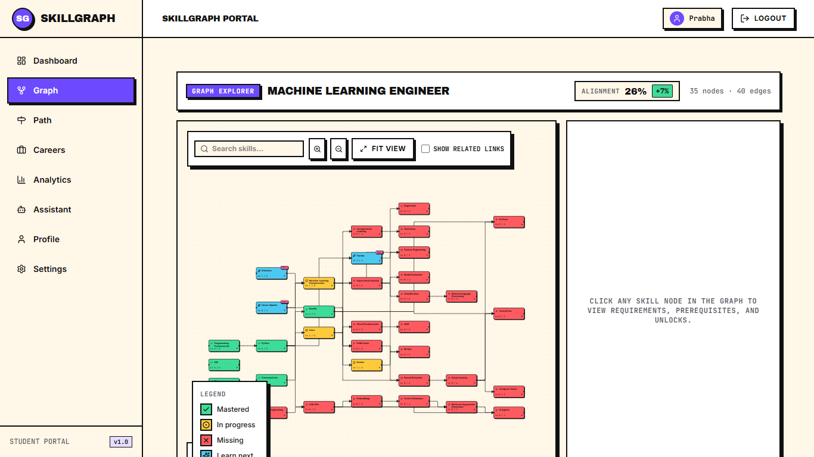
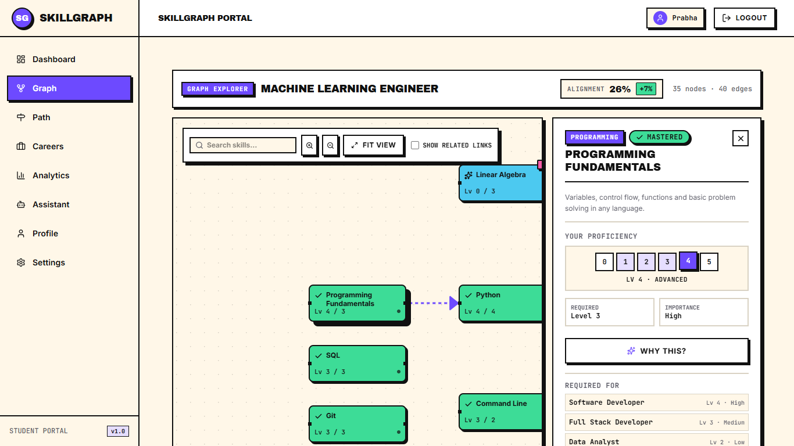
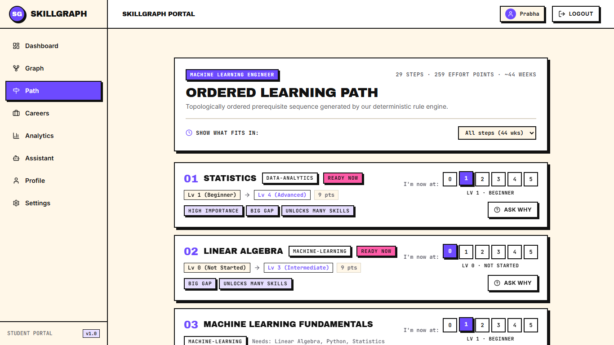
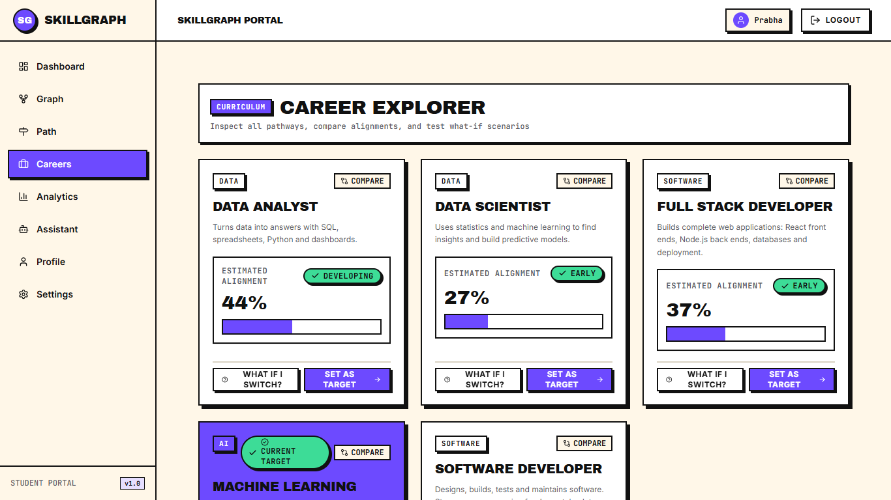
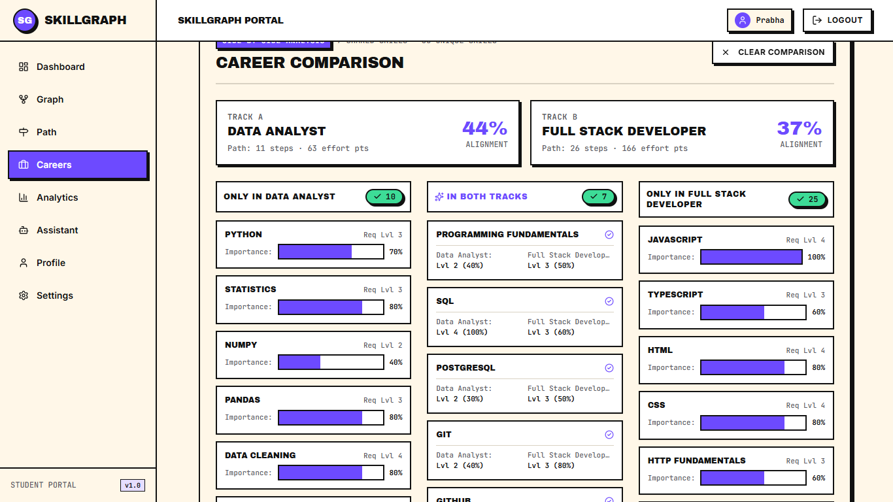
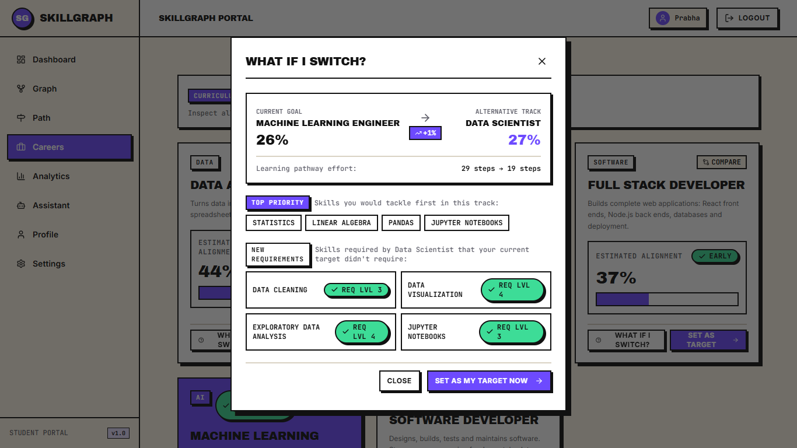
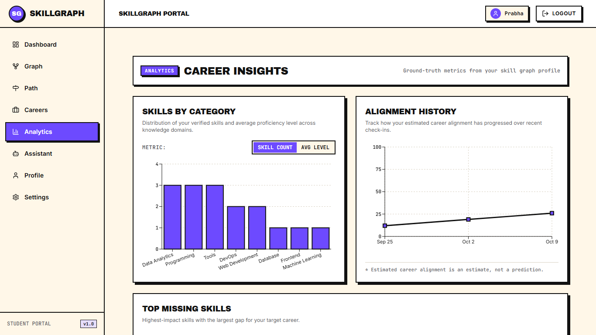
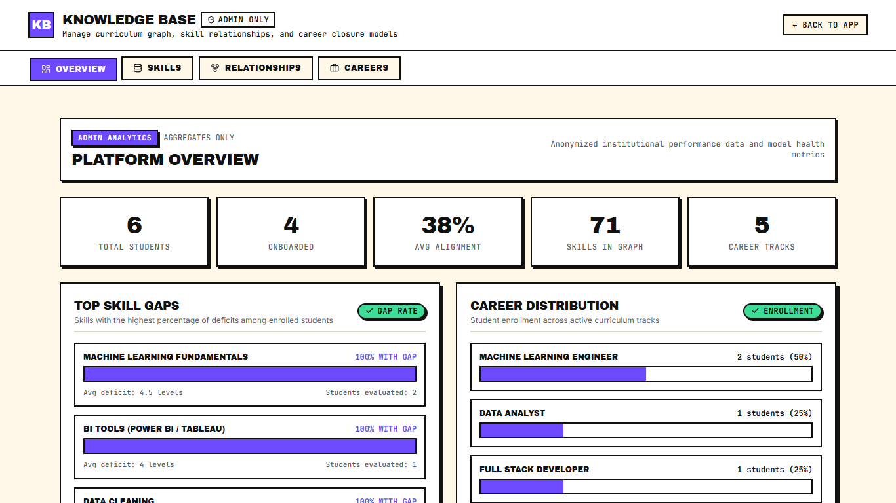

# Chapter: Graph Visualization & Learning Analytics

## 1. Why a Graph for Skills

University curricula, competency frameworks, and industry skill models are inherently non-linear. Traditional learning platforms model education as flat checklists or linear course sequences. In reality, technical skills form a **Directed Acyclic Graph (DAG)**:

1. **Multi-Hop Prerequisite Chains:** Advanced topics build strictly upon foundational concepts (for example, *Python* $\rightarrow$ *NumPy* $\rightarrow$ *Pandas* $\rightarrow$ *Machine Learning Fundamentals* $\rightarrow$ *Supervised Learning*).
2. **Shared Foundational Roots:** A single mathematical skill (such as *Linear Algebra*) serves as an essential prerequisite across divergent domains, including 3D Computer Graphics, Numerical Optimization, and Deep Learning.
3. **Branching and Re-Convergence:** Independent prerequisite tracks (such as software engineering principles and multivariate calculus) must converge before a student can tackle production machine learning systems.

A DAG representation $G = (V, E)$ provides formal mathematical structure: vertices $V$ represent discrete skills, while directed edges $E = \{(u, v)\}$ encode strict prerequisite relationships ($u$ is a prerequisite for $v$). Topological sorting over this graph guarantees that recommended learning paths never place advanced competencies before their foundational prerequisites.

---

## 2. How the Subgraph is Built

The global SkillGraph knowledge base contains 71 skills and 85 relationships. Projecting all 71 nodes simultaneously creates visual noise and cognitive overload. To provide an actionable workspace, the platform generates a **prerequisite-closed career subgraph** tailored to the student's selected career:

### Mathematical Subgraph Formulation
For a target career $C$, the backend service `getGraphAnalysis` in `analysis.service.js` constructs the career subgraph $G_C = (V_C, E_C)$:
- **Vertex Set $V_C$:** The exact set of skills configured for the career, $V_C = \text{careerSkills}(C)$ (for example, 35 skills for *Machine Learning Engineer*, 24 for *Data Scientist*, 32 for *Full Stack Developer*, 26 for *Software Developer*, 17 for *Data Analyst*).
- **Edge Set $E_C$:** All prerequisite relationships where both source and target belong to the career skill set:
  $$E_C = \{ (u, v) \in E \mid u \in V_C \land v \in V_C \land \text{type}(u, v) = \text{PREREQUISITE} \}$$
- **Prerequisite Closure Guarantee:** A career curriculum is valid if and only if it is closed under prerequisite reachability:
  $$\forall v \in V_C, \quad (u, v) \in E \implies u \in V_C$$
  This invariant is verified by the seeder validator (`backend/seed/validate.js`) and enforced during admin career modifications (`validatePrerequisiteClosure` in `backend/src/validators/career.validator.js`).
- **Semantic Edge Overlay:** Clients can toggle `?related=true` to display dashed `RELATED_TO` edges connecting conceptually aligned skills within $V_C$, providing associative context without affecting topological ordering.

---

## 3. Node States and Colours Table

The visual appearance of each skill node reflects the student's real-time progress against target career requirements. Node states are computed by the pure engine function `getNodeState({ gap, proficiency, isRecommended, isRelevant })`:

| State | Design Token | Hex Color | Icon | Semantic Meaning | Mathematical Condition |
|---|---|---|---|---|---|
| `mastered` | `bg-state-mastered` | `#3DDC97` (Emerald) | `Check` (✓) | Fully Mastered | $\text{gap}(s) = \max(0, \text{requiredLevel}(s) - \text{proficiency}(s)) = 0$ |
| `partial` | `bg-state-partial` | `#FFC93C` (Amber) | `CircleDot` (⊙) | In Progress / Developing | $\text{gap}(s) > 0 \land \text{proficiency}(s) > 0 \land s \notin \text{NextSkills}$ |
| `missing` | `bg-state-missing` | `#FF5A5F` (Coral) | `X` (✕) | Not Started / Gap | $\text{gap}(s) > 0 \land \text{proficiency}(s) = 0 \land s \notin \text{NextSkills}$ |
| `recommended` | `bg-state-next` | `#4CC9F0` (Cyan) | `Sparkles` (✦) | High Priority Next Step | $s \in \text{NextSkills}$ (top 3 highest priority ready candidates) |
| `not_relevant` | `bg-state-muted` | `#D7D7DC` (Muted Grey) | `Minus` (−) | Outside Target Career | $s \notin V_C$ (rendered in global or explorer views) |

> **Accessibility Rule (`DESIGN_SYSTEM.md` §3):** State is never conveyed through color alone. Every node combines a distinct background token, a geometric Lucide icon, a text badge, and an ARIA label (`"${name}, ${state}, level ${proficiency} of ${requiredLevel} required"`).

---

## 4. Layout Approach (Dagre) and Interaction Features

### Left-to-Right DAG Layout
Graph coordinates are computed using `@dagrejs/dagre` in `frontend/src/components/graph/layout.js`:
- **Orientation:** Left-to-Right (`rankdir: 'LR'`), mapping foundational root competencies on the left and specialized capstone skills on the right.
- **Node Geometry:** Fixed dimensions of $168\text{px} \times 64\text{px}$ adhering to neo-brutalist zero-radius geometry (`rounded-none`, $2\text{px}$ solid ink borders).
- **Separation Constants:** `nodesep: 40px` (vertical gap between parallel nodes within a rank) and `ranksep: 90px` (horizontal distance between ranks).
- **Coordinate Normalization:** Dagre returns center coordinates $(x, y)$, which are translated to top-left canvas positions $(x - w/2, y - h/2)$ for React Flow.
- **Overlap Prevention:** The combination of fixed node boxes, generous rank separation, and strict DAG topological layering prevents visual overlaps across all career subgraphs.

### Interactive Canvas Features
1. **Pan and Zoom Navigation:** Smooth 60fps canvas navigation using trackpad gestures, mouse drag, or the neo-brutalist canvas toolbar.
2. **Auto-Fit View:** The `Fit view` control auto-centers and bounds the subgraph to the viewport on load and window resizing.
3. **Search & Focus:** An auto-complete search bar enables students to locate any skill; selecting a skill smoothly pans the canvas and focuses the node.
4. **Slide-Out Detail Panel (`SkillDetailPanel.jsx`):** Clicking a node opens an inspection drawer showing:
   - Category, difficulty, importance slider, and target career required level.
   - Interactive `LevelPicker` (Levels 0–5) triggering optimistic updates and background recalculation (`PATCH /users/me/skills/:skillSlug`).
   - Clickable Prerequisite and Unlocks chips that center the canvas on the connected skill.
   - Grounded AI Explanation (`POST /ai/explain`) answering *"Why do I need this skill for my target career?"*.

---

## 5. Learning Pathways, Career Exploration & Simulations

The visual graph serves as the underlying engine for the curriculum pathways, multi-track career comparisons, and what-if simulations:

- **Curriculum Learning Path (`/app/path`):** Translates the 2D DAG into a topologically sorted linear sequence. Step 1 is highlighted with a `READY NOW` badge if all prerequisites are fulfilled; blocked steps display missing prerequisite dependencies. Inline `LevelPicker` controls allow students to record mastery, immediately stamping completed steps with "✓ Done".

- **Multi-Career Exploration (`/app/careers`):** Renders alignment scorecards across all active industry career tracks in parallel (`GET /analysis/career-fit?career=<slug>`).

- **Side-by-Side Career Comparison (`/app/careers?compare=a,b`):** Deconstructs two career profiles into a 3-column Venn comparison: *Only in Career A*, *Common to Both*, and *Only in Career B*. Duplicate career selection is blocked with a validation message.

- **What-If Career Switch Modal (`WhatIfModal.jsx`):** Allows students to simulate switching their career target without mutating database records. Computes the estimated alignment delta, newly required prerequisite skills, and revised effort points.

---

## 6. Student Analytics

The Student Analytics dashboard (`/app/analytics`) visualizes personal progress trends and curriculum deficits using Recharts SVG components:

1. **Category Distribution (`CategoryBarChart.jsx`):**
   - Plots student competency volume and average proficiency across the 13 knowledge categories (such as *Programming*, *Data Analytics*, *DevOps*).
   - Allows students to toggle between skill count (breadth) and average proficiency level (depth).
2. **Alignment History (`AlignmentLineChart.jsx`):**
   - Chronological timeline tracking historical `fitScore` across saved `AlignmentSnapshot` milestones.
   - Illustrates learning velocity and the quantifiable impact of recently acquired skills.
   - Displays an `EmptyState` when fewer than 2 snapshots exist, prompting students to record progress over time.
3. **Top Missing Skills Deficit (`TopMissingBarChart.jsx`):**
   - Horizontal bar chart highlighting the top 5 largest skill gaps in the student's target career.
   - Formats deficits explicitly in required levels (`${gap} lvls`) and prioritizes skills by career importance.
4. **Mobile & Screen Reader Accommodations:**
   - On 390px mobile screens, category labels are truncated (`val.slice(0, 9)…`) and chart margins adjusted to prevent clipping.
   - Every chart embeds a hidden semantic HTML `<table>` with descriptive ARIA attributes for screen reader accessibility.

---

## 7. Admin Analytics & The Privacy Mandate

The Admin Overview portal (`/admin/overview`) surfaces institutional aggregates to guide academic program leadership and curriculum designers:

### Institutional Insights
- **Cohort Metric Cards:** Total registered students, onboarded student count, average cohort alignment score, total catalog skills, and active career tracks.
- **Top Curriculum Gaps:** Ranks skills by the percentage of enrolled students experiencing a deficit (`percentWithGap`), pinpointing institutional curriculum bottlenecks.
- **Career Track Distribution:** Percentage breakdown of student career aspirations to support elective scheduling and lab resource allocation.
- **Skill Popularity & Semester Progression:** Identifies most-adopted skills across the student body and tracks average alignment score growth across Semesters 1 through 8.
- **ML Model Benchmarks Panel:** Displays recommendation ranking metrics (Precision@3, Recall@3, HitRate@3, MRR) evaluating the synthetic-trained logistic regression model against rule-based baselines.

### The Privacy Mandate: Zero Student PII
A foundational architectural rule in SkillGraph is that **no student Personally Identifiable Information (name, email, profile photo, or ID) is accessible on admin screens or returned by admin analytics endpoints**.

**Ethical Justification:** Faculty and institutional leaders need aggregate data to revise syllabi, allocate teaching assistants, and identify common prerequisite hurdles. Exposing identifiable student profiles would create surveillance risks, potential unconscious bias in student grading, and violations of student privacy regulations.

---

## 8. Computation of Analytics Metrics

All analytics calculations are isolated in backend service functions:

| Analytics Metric | Backend Service Function | Source Collections / Engine Logic |
|---|---|---|
| **Category Distribution** | `getStudentInsights(userId)` in `analytics.service.js` | Aggregation over `UserSkill` filtered by `proficiency > 0`, grouped by `skillId.category`; computes `count` and $\text{avgProf} = \frac{\sum \text{prof}}{\text{count}}$. |
| **Alignment Trend** | `getStudentInsights(userId)` in `analytics.service.js` | Chronological query on `AlignmentSnapshot` sorted by `createdAt: 1`. Returns `{ empty: true }` when count $< 2$. |
| **Top Missing Skills** | `getStudentInsights(userId)` in `analytics.service.js` | Evaluates target career model via `computeGapItems(model, profile)`, filters items with $\text{gap} > 0$, and returns top 5 sorted by priority. |
| **Cohort Overview** | `getAdminOverview()` in `analytics.service.js` | Parallel MongoDB queries: `User.countDocuments()`, `Skill.countDocuments()`, `Career.countDocuments()`, and `$group` pipeline averaging latest student alignment scores. |
| **Institutional Skill Gaps** | `getAdminSkillGaps(limit)` in `analytics.service.js` | Computes student gaps against their target career models; derives $\text{percentWithGap} = \frac{\text{studentsWithGap}}{\text{totalConsidered}} \times 100$ and average gap. |
| **Career Distribution** | `getAdminCareerDistribution()` in `analytics.service.js` | MongoDB aggregation grouping active students by `targetCareerId`, computing cohort percentage. |
| **Skill Popularity** | `getAdminSkillPopularity(limit)` in `analytics.service.js` | Aggregates `UserSkill` where `proficiency > 0`, grouping by `skillId` and sorting by student count descending. |
| **Semester Progression** | `getAdminSemesterDistribution()` in `analytics.service.js` | Aggregates students by `semester` (1–8), joining latest `AlignmentSnapshot` and active `UserSkill` counts to compute mean alignment and skills per semester. |
| **Model Benchmarks** | `getAdminMlInfo()` in `admin.service.js` | Loads offline validation metrics generated during model training (`ml-service/reports/metrics.json`). |

---

## 9. Performance & Architectural Notes

- **Custom Node Memoization:** The React Flow custom node component (`SkillNode.jsx`) is wrapped in `React.memo()`. Panning, zooming, and selecting nodes does not trigger full graph re-renders.
- **TanStack Query Caching:** Client queries cache graph and analytics responses (`staleTime: 60s`), deduplicating network calls across page transitions.
- **Pure In-Memory Engine:** Graph construction and topological sorting (`backend/src/services/engine/graph.js`) execute in pure memory without database calls during graph assembly, completing in $< 5\text{ms}$.
- **Rendering Performance:** Verified at 60 FPS during continuous pan and zoom on the largest 35-node subgraph (*Machine Learning Engineer*).

---

## 10. Limitations

1. **Client-Side Dagre Computation:** Graph layout coordinates are calculated synchronously on the client thread. While instantaneous ($< 15\text{ms}$) for subgraphs up to 100 nodes, layouts exceeding 2,000 nodes would block the main thread and require offloading to Web Workers or server-side layout precomputation.
2. **Pruned Cross-Career Context:** Subgraph projection intentionally removes skills outside the active career to minimize visual complexity. While clean, this prevents students from discovering peripheral skills without switching target tracks.
3. **Mobile Screen Form Factor:** On mobile devices (390px viewport width), complex multi-rank graphs require extensive panning. Mobile users are therefore directed to the linear Learning Path (`/app/path`) as their primary curriculum view.

---

## 11. Likely Viva Questions & Model Answers

### Q1: Why did you choose Dagre over D3 force-directed layout or fixed manual coordinates?
**Answer:** A force-directed layout models undirected physical springs, which produces non-deterministic node positions and obscures hierarchical prerequisite order. Fixed coordinates fail whenever skills or prerequisites are dynamically added or edited by admins. Dagre is a deterministic Directed Acyclic Graph layout algorithm that computes topological hierarchical layers, guaranteeing that foundational prerequisites consistently render to the left of dependent skills.

### Q2: How do you determine node colours, and how do you ensure accessibility for colour-blind users?
**Answer:** Node state is calculated deterministically by evaluating skill gap, current proficiency, and recommendation ranking: green for mastered ($\text{gap} = 0$), amber for in-progress, coral for missing, and cyan for top recommended skills. To ensure strict WCAG compliance, colour is never the sole indicator of state. Every node incorporates a distinct geometric Lucide icon (check, circle-dot, cross, sparkles), text labels, and ARIA screen reader properties.

### Q3: What does the Alignment History line chart show, and why is it empty for new students?
**Answer:** The alignment history chart plots a student's estimated career alignment score across distinct point-in-time milestones stored in `AlignmentSnapshot` documents. A minimum of two snapshots is mathematically required to draw a trend line and compute velocity. If a student has just completed onboarding and has only one snapshot, the UI renders an accessible empty state explaining that further skill updates will establish their progression curve.

### Q4: Why are admin analytics strictly aggregated with zero individual student listings?
**Answer:** Educational analytics platforms must balance institutional decision-making with student privacy rights. Administrators require macro-level indicators to identify systemic curriculum bottlenecks, allocate teaching resources, and forecast elective demand. Exposing individual student profiles would introduce surveillance concerns and potential unconscious bias in grading without adding value to institutional curriculum planning.

### Q5: How would this graph visualization scale if the curriculum grew to 5,000 nodes?
**Answer:** At 5,000 nodes, client-side Dagre layout would introduce main-thread lag, and SVG rendering would suffer from DOM node bloat. To scale, we would: (1) precompute hierarchical layout coordinates asynchronously on the backend or in a Web Worker, (2) implement semantic zoom with cluster-based level-of-detail abstraction, and (3) switch from SVG rendering to WebGL/Canvas via React Flow or Pixi.js, rendering only nodes within the active viewport bounding box.

### Q6: Why is the graph layout oriented Left-to-Right (LR) rather than Top-to-Bottom (TB)?
**Answer:** Left-to-right orientation aligns with the Western cognitive mental model of a timeline advancing from left to right. Furthermore, standard desktop and laptop computer displays have wide 16:9 aspect ratios. An LR layout utilizes available horizontal screen real estate much more effectively than a vertical hierarchy, which would require excessive vertical scrolling.

### Q7: How do you guarantee that nodes and edges never overlap in the career subgraphs?
**Answer:** We enforce uniform node bounding boxes ($168\text{px} \times 64\text{px}$) and assign generous separation parameters in Dagre (`nodesep: 40px`, `ranksep: 90px`). Because the backend strictly prohibits cyclic dependencies through graph cycle validation, Dagre can assign every node to a discrete topological rank without node collision.

### Q8: What happens in the graph and analytics if a student has an empty profile with zero rated skills?
**Answer:** If a student has no skills rated, the engine treats all required skills as proficiency level 0 ($\text{gap} = \text{requiredLevel}$). The graph displays foundational root skills as cyan (`recommended` / `isReadyNow = true`) and all dependent skills as coral (`missing`). The analytics view displays a 0% alignment score and renders an empty state on the history chart inviting the student to record their initial competencies.
